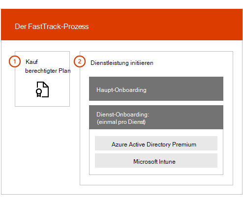

# Übersicht über den FastTrack Center-VorteilFastTrack Center Benefit Overview

Mit dem Vorteil von "schnell Center" für Microsoft Azure Active Directory Premium und Microsoft InTune arbeiten Sie Remote mit Spezialisten in der Umgebung zusammen, um die Bereitstellung und die Verwendung in Ihrer Organisation zu planen.With FastTrack Center Benefit for Microsoft Azure Active Directory Premium and Microsoft Intune, you work remotely with FastTrack Specialists to get your environment ready for use and to plan the rollout and usage within your organization. Weitere Informationen zur Berechtigung finden Sie unter Übersicht über den [Leistungsprozess für Enterprise Mobility + Security (EMS)](EMS-fasttrack-process.md).To learn more about eligibility, see [FastTrack Center Benefit Process for Enterprise Mobility + Security (EMS)](EMS-fasttrack-process.md).

Onboarding hat zwei Hauptkomponenten:Onboarding has two major components:

-   **Haupt** -Onboarding-Aufgaben für die Mandanten Konfiguration und-Integration in Azure Active Directory, falls erforderlich.**Core onboarding** - Tasks required for tenant configuration and integration with Azure Active Directory, if needed. Das Haupt-Onboarding stellt auch die Basis für das Onboarding anderer Microsoft Online-berechtigter Dienste dar.Core onboarding also provides the baseline for onboarding other Microsoft Online eligible services.

-   **Dienst** Onboarding-Aufgaben, die zum Konfigurieren einer der eigenständigen Versionen der EMS-Arbeitsauslastung (Azure AD Premium und InTune) erforderlich sind.**Service onboarding** - Tasks required to configure any of the standalone variants of the EMS workload (Azure AD Premium and Intune).

Im folgenden Diagramm werden die allgemeinen Onboarding-Phasen für die Vorteile des "schnell Center" beschrieben.The following diagram describes the high-level onboarding phases for the the FastTrack Center Benefit.

So funktioniert der Prozess:Here's how the process works:

- Das Center für die Wiederinbetriebnahme versucht, Sie zu kontaktieren, um Onboarding-Hilfe anzubieten, nachdem Sie Lizenzen für einen berechtigten Dienst erworben haben.The FastTrack Center tries to contact you to offer onboarding assistance after you purchase licenses of an eligible service. Sie können auch Unterstützung vom [Center](https://go.microsoft.com/fwlink/?linkid=780698) in der Nähe anfordern, wenn Sie bereit sind, diese Dienste für Ihre Organisation bereitzustellen.You can also request assistance from the [FastTrack Center](https://go.microsoft.com/fwlink/?linkid=780698) if you're ready to deploy these services for your organization. Um Hilfe anzufordern, melden Sie sich mit Ihrem Geschäfts-oder Schulkonto beim [Center](https://go.microsoft.com/fwlink/?linkid=780698) für die Arbeit oder in der Schule an, wechseln Sie zum Dashboard, erweitern Sie den Link **need help?** in der unteren rechten Ecke der Seite, und folgen Sie dann den Anweisungen, um Ihre Anfrage abzuschließen.To request assistance, sign in to the [FastTrack Center](https://go.microsoft.com/fwlink/?linkid=780698) with your work or school account, go to the dashboard, expand the **Need Help?** link at the lower-right corner of the page, and then follow the prompts to complete your request. Sobald der Onboarding-Support gestartet wurde, richten wir einen Zeitplan für Onlinebesprechungen ein.Once onboarding support starts, we’ll set up a schedule of online meetings.

-   Das Team für die Zusammenarbeit hilft Ihnen zunächst bei den wichtigsten Funktionen (gilt für alle Microsoft Online Services) und dann beim Onboarding der einzelnen berechtigten Dienste.The FastTrack team helps you first with core capabilities (common for all Microsoft Online Services) and then with onboarding each eligible service.

Der gesamte Onboarding-Support wird Remote von zugewiesenen Team Mitarbeitern bereitgestellt:All onboarding support is provided remotely by assigned FastTrack personnel:

-   Mit einer Kombination aus Tools, Dokumentation und Anleitung unterstützt Sie das Team für den Einstieg mit verschiedenen Onboarding-Aktivitäten.The FastTrack team remotely assists you with various onboarding activities by using a combination of tools, documentation, and guidance.

-   Onboarding-Support wird vom Center in der Nähe bereitgestellt und ist während der normalen Geschäftszeiten für eine bestimmte Region verfügbar.Onboarding support is provided by the FastTrack Center, and is available during normal business hours for a given region.

-   Der Onboarding-Support ist in den Sprachen Chinesisch (traditionell), vereinfachtes Chinesisch (nur Ressourcen sprechen), Englisch, Französisch, Deutsch, Italienisch, Japanisch, Koreanisch, Portugiesisch (Brasilien), Spanisch, Thailändisch und Vietnamesisch verfügbar.Onboarding support is available in Traditional Chinese, Simplified Chinese (resources speak Mandarin only), English, French, German, Italian, Japanese, Korean, Portuguese (Brazil), Spanish, Thai, and Vietnamese.

-   Das Team kann direkt mit Ihnen oder Ihrem Vertreter arbeiten.The FastTrack team can work directly with you or your representative.

> [!NOTE]
> **Möchten Sie mehr erfahren?** siehe [Enterprise Mobility + Security](https://www.microsoft.com/cloud-platform/enterprise-mobility).**Want to learn more?** see [Enterprise Mobility + Security](https://www.microsoft.com/cloud-platform/enterprise-mobility).

## Nächste SchritteNext steps

[Vorteile für den Notfall Center für EMS-Source-Umgebungs ErwartungenFastTrack Center benefit for EMS - Source environment expectations](EMS-source-environment-expectations.md)
