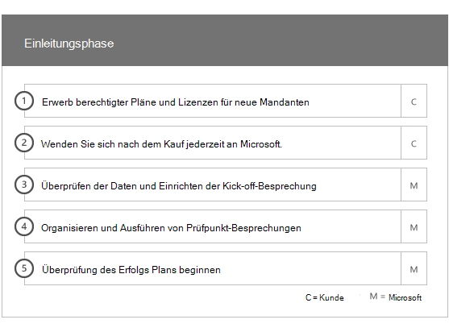
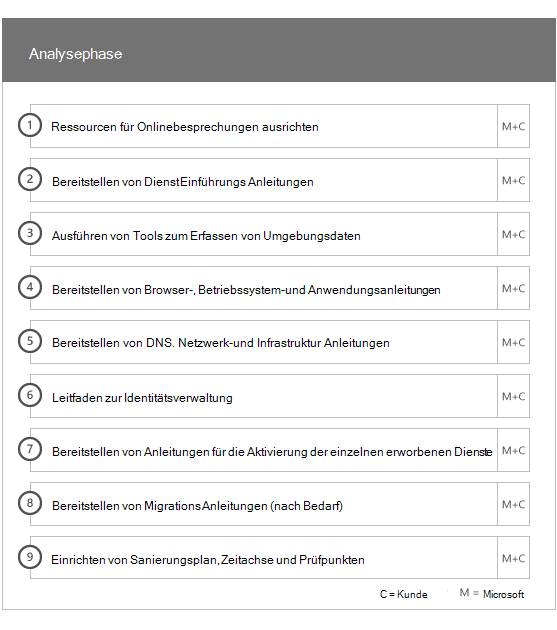
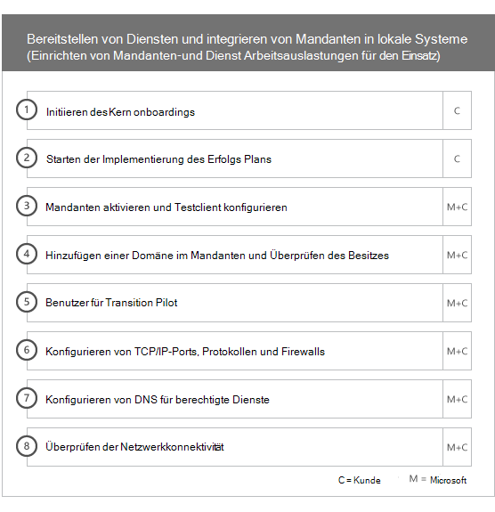
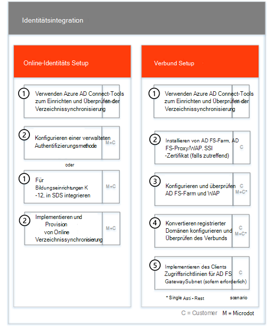
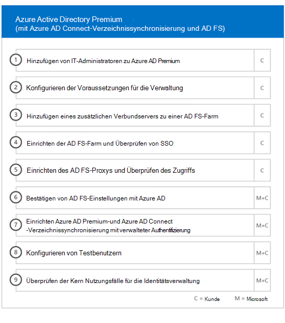
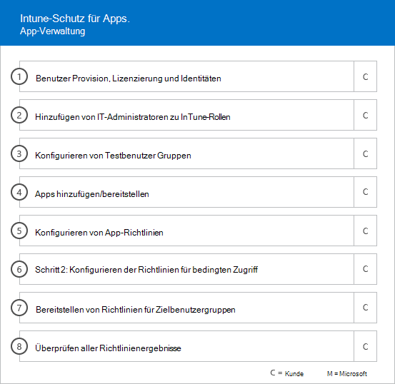
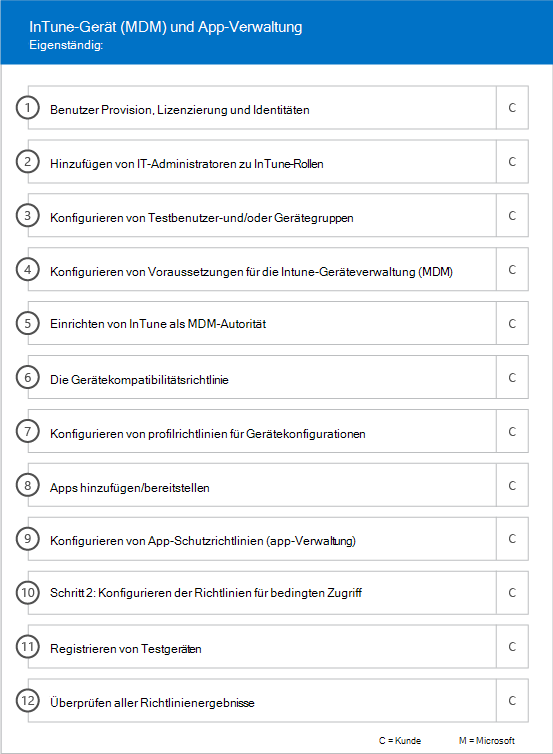

# Onboarding-Phasen

Wenn Sie die [Berechtigten Dienste und Pläne](M365-eligible-services-and-plans.md) verwenden, um Microsoft Azure Active Directory Premium, Microsoft Intune und Azure Information Protection für den Einsatz vorzubereiten, besteht der Prozess aus mehreren Phasen. In den folgenden Abschnitten wird jede Phase des Onboarding-Prozesses beschrieben.

Das Onboarding hat vier Hauptphasen:

## Einleitungsphase

Nachdem Sie die gewünschte Anzahl von Lizenzen erworben haben, befolgen Sie die Anleitung in der E-Mail zur Kaufbestätigung, um die Lizenzen Ihrem vorhandenen oder neuen Mandanten zuzuordnen. Microsoft prüft dann Ihre Berechtigung für den FastTrack Center-Vorteil und versucht, Kontakt mit Ihnen aufzunehmen, um Unterstützung beim Onboarding anzubieten.

> [!NOTE]
> Sie können auch Unterstützung vom [FastTrack Center](https://go.microsoft.com/fwlink/?linkid=780698) anfordern, wenn Sie bereit sind, diese Dienste für Ihre Organisation bereitzustellen.

### So fordern Sie Unterstützung an

1. Melden Sie sich bei der [FastTrack-Website](https://go.microsoft.com/fwlink/?linkid=780698) an.
2. Wählen Sie **FastTrack** aus.
3. Wählen Sie **Dienste** aus.
4. Füllen Sie das Formular **Antrag auf Unterstützung bei Microsoft 365** aus.

Sobald der Onboarding-Support begonnen hat, richten wir einen Zeitplan für Onlinebesprechungen ein.

Als Microsoft Partner können Sie auch im Namen eines Kunden Hilfe auf der [FastTrack-Website](https://go.microsoft.com/fwlink/?linkid=780698) anfordern. Gehen Sie hierzu folgendermaßen vor:

1. Melden Sie sich bei der [FastTrack-Website](https://go.microsoft.com/fwlink/?linkid=780698) an.
2. Wählen Sie **FastTrack** aus.
3. Wählen Sie **Meine Kunden** aus.
4. Suchen Sie nach Ihrem Kunden, oder wählen Sie ihn aus der Kundenliste aus.
5. Wählen Sie **Dienste** aus.
6. Füllen Sie das Formular **Antrag auf Unterstützung bei Microsoft 365** aus.

Sobald der Onboarding-Support beginnt, richtet FastTrack einen Zeitplan für Onlinebesprechungen ein, um den Onboarding-Prozess zu besprechen, Daten zu überprüfen und eine Auftaktbesprechung zu vereinbaren.

## Analysephase

Nachdem der Onboarding-Prozesses eingeleitet wurde, arbeitet das FastTrack Center bei der Analyse Ihrer Quellumgebung und der Anforderungen mit Ihnen zusammen. Tools zur Analyse Ihrer Umgebung werden ausgeführt und FastTrack-Spezialisten begleiten Sie bei der Bewertung von lokalem Active Directory, Internetbrowsern, Betriebssystemen auf Kundengeräten, des DNS-Systems, des Netzwerks, der Infrastruktur und des Identitätsverwaltungssystems, um zu bestimmen, ob für das Onboarding Änderungen erforderlich sind.

Das FastTrack Center führt Sie auch zu Anleitungen, wie Sie die erfolgreiche Umsetzung der berechtigten Dienste fördern können.

Basierend auf Ihrer aktuellen Einrichtung erstellen wir einen Korrekturplan. Nach Befolgen dieses Plans wird Ihre Quellumgebung an die Mindestanforderungen für ein erfolgreiches Onboarding für EMS oder deren einzelne Clouddienste angepasst. Für die Korrekturphase setzen wir auch entsprechende Telefonkonferenzen an.

## Korrekturphase
Sie führen die Aufgaben im Korrekturplan für Ihre Quellumgebung aus, damit Sie die Anforderungen für das Onboarding der einzelnen Dienste erfüllen.

Bevor Sie die Aktivierungsphase einleiten, überprüfen wir gemeinsam die Ergebnisse der Korrekturaktivitäten, um sicherzustellen, dass Sie auf dem benötigten Stand sind.

## Aktivierungsphase
Nach Abschluss aller Korrekturaktivitäten ist der nächste Schritt im Projekt die Konfiguration der Kerninfrastruktur für die Nutzung der Dienste und die Bereitstellung jedes berechtigten EMS-Clouddiensts.

**Aktivierungsphase – Kernfunktionen**

Zum Haupt-Onboarding zählen die Bereitstellung des Diensts sowie die Integration von Mandanten und Identitäten. Es umfasst außerdem Schritte zur Bereitstellung einer Basis für das Onboarding von Onlinediensten wie Azure AD Premium, Intune und Azure Information Protection.

> [!NOTE]
> WAP steht für Webanwendungsproxy SSL steht für Secure Sockets Layer SDS steht für School Data Sync Weitere Informationen zu SDS finden Sie unter [Willkommen bei Microsoft School Data Sync](https://go.microsoft.com/fwlink/?linkid=871480).

> [!NOTE]
> Eine verwaltete Authentifizierungsmethode umfasst auch die Kennwort-Hashsynchronisierung. Die Identitätsintegration ist eine einmalige Aktivität und beinhaltet keine Migration oder Außerbetriebnahme vorhandener Authentifizierungsmethoden wie verwalteter oder Partner-Authentifizierungsmethoden.

### Aktivierungsphase – Azure AD Premium

Die Azure AD Premium-Umgebung kann mithilfe der Azure Active Directory Connect-Tool-Verzeichnissynchronisierung und der Active Directory-Verbunddienste (AD FS) (nach Bedarf) eingerichtet werden.

Für Azure AD Premium-Szenarios, die das Synchronisieren lokaler Identitäten mit der Cloud umfassen, helfen wir Ihnen beim Hinzufügen von IT-Administratoren und Benutzern zu Ihrem Abonnement, beim Konfigurieren von Verwaltungsvoraussetzungen, beim Einrichten von Azure AD Premium, beim Einrichten der Verzeichnissynchronisierung mit verwalteter Authentifizierung und AD FS mithilfe des Azure AD Connect-Tools, beim Konfigurieren von Testbenutzern und dem Überprüfen Ihrer Hauptanwendungsfälle für den Dienst.

Die Einrichtung von Azure AD Premium umfasst das Aktivieren der folgenden Features:

-   Azure Active Directory Self-Service-Kennwortzurücksetzung (SSPR).

-   Azure Multi-Factor Authentication (Azure MFA).

-   Bis zu drei (3) oder mehr SaaS-Anwendungsintegrationen (Software as a Service) mit einmaligem Anmelden (Single Sign-On, SSO) aus dem[Azure Active Directory Marketplace](https://azure.microsoft.com/marketplace/active-directory/).

-   Automatische Benutzerbereitstellung für vorintegrierte SaaS-Anwendungen, wie sie in der [Liste der App-Integrationstutorials](https://docs.microsoft.com/de-DE/azure/active-directory/saas-apps/tutorial-list) aufgeführt sind, beschränkt auf die ausgehende Bereitstellung.

-   Benutzerdefinierter Anmeldebildschirm, einschließlich Logo, Text und Bildern.

-   Self-Service-und dynamische Gruppen (Gruppen).

-   Azure Active Directory-Anwendungsproxy.

-   Azure Active Directory Connect Health.

-   Bedingter Zugriff in Azure Active Directory Domain Services.

-   Azure Active Directory Nutzungsbedingungen.

-   Azure Active Directory Identity Protection.

-   Azure Active Directory Privileged Identity Management.

-   Azure Active Directory Domain Services-Zugriffsüberprüfungen.

### Aktivierungsphase – Intune

Für Intune führen wir Sie durch die Vorbereitungen für die Verwendung von Microsoft Intune zur Verwaltung von Geräten. Die genauen Schritte hängen von Ihrer Quellumgebung ab und basieren auf dem Mobilgerät und den Anforderungen an die Verwaltung mobiler Apps. Die Schritte können Folgendes umfassen:

-   Lizenzierung Ihrer Endbenutzer. Wir unterstützen Sie zudem beim Aktivieren von Volumenlizenzen für Ihren Microsoft Cloud Service-Mandanten (nach Bedarf).

-   Konfigurieren von Identitäten, die von Intune verwendet werden sollen, entweder durch Nutzung Ihres lokalen Active Directory oder von Cloud-Identitäten.

-   Hinzufügen von Benutzern zu Ihrem Intune-Abonnement, Definieren von IT-Administratorrollen und Erstellen von Benutzer- und Gerätegruppen.

-   Konfigurieren Ihrer Autorität für die Verwaltung von Mobilgeräten (MDM), basierend auf Ihren Verwaltungsanforderungen, darunter:

    -   Festlegen von Intune als MDM-Autorität, wenn Intune Ihre einzige MDM-Lösung ist oder in Verbindung mit der Verwaltung mobiler Geräte für Office 365.

-   Bereitstellen von MDM-Anleitungen für Folgendes:

    -   Konfiguration von Testgruppen, die zur Validierung von MDM-Verwaltungsrichtlinien verwendet werden sollen.

    -   Konfigurieren von MDM-Verwaltungsrichtlinien und -Diensten wie:

        -   Anwendungsbereitstellung für jede unterstützte Plattform über Weblinks oder Deep Links.

        -   Richtlinien für bedingten Zugriff.

        -   Bereitstellung von E-Mail-, Wireless-Netzwerk- und VPN-Profilen (virtuelles privates Netzwerk), wenn Sie eine bestehende Zertifizierungsstelle, Wi-Fi- oder VPN-Infrastruktur in Ihrer Organisation haben.

        -   Einrichten des Microsoft Intune Exchange Connector (falls vorhanden).

        -   Verbindung zum Intune Data Warehouse

        -   Integration von Intune mit:
            -   Team Viewer für Remote-Unterstützung (Team Viewer-Abonnement erforderlich).

            -   Mobile Threat Defense (MTD)-Partnerlösungen (Mobile Threat Defense-Abonnement erforderlich).

            -   Telecom Expense Management Solution (Telecom Expense Management Solution-Abonnement erforderlich).

            -   Windows Defender Advanced Threat Protection (Windows E5- oder Microsoft 365 E5-Lizenzen erforderlich).

    -   Registrieren von Geräten jeder [unterstützten Plattform](https://technet.microsoft.com/library/dn600287.aspx) bei Intune.

-   Bereitstellen von App-Schutz-Anleitungen für Folgendes:

    -   Konfigurieren von App-Schutzrichtlinien für jede unterstützte Plattform.

    -   Konfigurieren von Richtlinien für bedingten Zugriff für verwaltete Apps.

    -   Adressieren entsprechender Benutzergruppen mit den obigen MAM-Richtlinien.

    -   Verwenden von Verwendungsberichten für verwaltete Anwendungen.

-   Bereitstellen von Anleitungen zur PC-Verwaltung für Folgendes:

    -   Installieren der Intune-Clientsoftware (bei Bedarf).

    -   Verwenden der in Intune verfügbaren Soft- und Hardwareberichte.

    > [!IMPORTANT]
    > FastTrack unterstützt nicht die klassische PC-Verwaltung von Windows 10 mit Intune. FastTrack unterstützt nur die Windows 10-Geräteverwaltung durch Intune Mobile Device Management (MDM).

#### Windows Autopilot

FastTrack kann die Gerätebereitstellung mit Windows Autopilot und Intune vereinfachen, indem Sie die Endbenutzer mit neuen Geräten ausstatten, ohne benutzerdefinierte Betriebssystemabbilder erstellen, verwalten und auf Ihren Geräte anwenden zu müssen.

FastTrack unterstützt die folgenden Autopilot-Szenarios:

- **Azure AD Self-Service:** Geräte werden in Azure AD aufgenommen und bei Intune registriert. Dieses Szenario wird unterstützt, wenn Windows 10 1703 und die neuesten Versionen verwendet werden.

- **Hybrid Azure AD Self-Service:** Geräte werden sowohl in das lokale Azure AD als auch Azure AD aufgenommen und bei Intune registriert. Dieses Szenario wird unterstützt, wenn Windows 10 1809 und die neuesten Versionen verwendet werden.

- **Selbstbereitstellung:** Geräte werden automatisch in Azure AD aufgenommen. Dieses Szenario wird unterstützt, wenn Windows 1809 und die neuesten Versionen verwendet werden.

    > [!IMPORTANT]
    > FastTrack unterstützt keine vom Konfigurations-Manager initiierten Autopilot-Szenarios.

Die Schritte zum Einrichten von Windows Autopilot hängen von der Quellumgebung ab und können Folgendes umfassen:

- Konfigurieren und Einrichten von Microsoft Intune für Windows Autopilot.

- Konfigurieren von dynamischen Gruppen in Azure AD

- Einfügen Ihres Firmenlogo in Azure AD.

- Erstellen und Zuweisen von Geräten zu Windows-Autopilot-Profilen (z.B. ein Windows-Autopilot-Profil, das die Erstellung eines lokalen Administratorkontos einschränkt).

- Passen Sie die Out-of-Box-Erfahrung (OOBE) an, um den Anforderungen der Organisation zu entsprechen.

- Konfigurieren der automatischen MDM-Registrierung in Azure AD und Intune.

#### Sicheres Bereitstellen von Outlook für iOS und Android

FastTrack kann Sie unterstützen, indem es Outlook für iOS und Android in Ihrer Organisation sicher bereitstellt, um dafür zu sorgen, dass die Benutzer alle erforderlichen Apps installiert haben.

Die Schritte zur sicheren Bereitstellung von Outlook Mobile für iOS und Android mit Intune sind von der Quellumgebung abhängig und können Folgendes umfassen:

- Laden Sie Outlook für iOS und Android, Microsoft Authenticator und die Intune-Unternehmensportal-App über den Apple App Store oder Google Play Store herunter.
- Stellen Sie auch Anleitungen zu Folgendem bereit:
    - Bereitstellung von Outlook für iOS und Android, Microsoft Authenticator und der Intune-Unternehmensportal-App mit Intune.
    - App-Schutzrichtlinien
    - Richtlinien für bedingten Zugriff
    - App-Konfigurationsrichtlinien

    > [!IMPORTANT]
    > Das FastTrack -Team unterstützt nicht die Sicherung von Outlook für iOS und Android mit Exchange-Postfachrichtlinien für Mobilgeräte.

#### Mitverwaltung

FastTrack führt Sie durch die Vorbereitung der gleichzeitigen Verwaltung von Windows 10-Geräten sowohl mit dem Configuration Manager als auch mit Intune. Die genauen Schritte hängen von der Quellumgebung ab und können Folgendes umfassen:

- Erläutern der Vorteile der gemeinsamen Verwaltung.

- Lizenzieren Ihrer Endbenutzer. FastTrack unterstützt Sie zudem beim Aktivieren von Volumenlizenzen für Ihren Microsoft Cloud Service-Mandanten (nach Bedarf).

- Konfigurieren von Identitäten, die von Intune verwendet werden sollen, entweder durch Nutzung Ihres lokalen Active Directory und/oder von Cloud-Identitäten.

- Hinzufügen von Benutzern zu Ihrem Intune-Abonnement, Definieren von IT-Administratorrollen und Erstellen von Benutzer- und Gerätegruppen.

- Bereitstellen von Anleitungen zum Wechsel von Intune, das im System Center Configuration Manager (Hybrid) integriert ist, zu Intune Standalone.

- Bereitstellen von Anleitungen zum Einrichten der automatischen MDM-Registrierung in Azure Active Directory Domain Services.

- Bereitstellen von Anleitungen zur Einrichtung der hybriden Azure Active Directory-Verknüpfung.

- Bereitstellen von Anleitungen zum Einrichten von Cloud Management Gateway

- Aktivierung der Mitverwaltung in der Configuration Manager-Konsole.

- Konfigurieren unterstützter Arbeitsauslastung, die Sie in Intune verschieben möchten.

- Installieren des Konfigurations-Manager-Clients in Geräten, die bei Intune registriert sind.

- Bereitstellen von Anleitungen zur Überwachung der Mitverwaltungsaktivitäten in Ihrer Umgebung.

FastTrack stellt Ihnen auch Anleitungen dazu bereit, wie Sie die erfolgreiche Umsetzung der berechtigten Dienste fördern können.

#### Aktivierungsphase – Azure Information Protection

Kunden erhalten Anleitungen für Folgendes: 

- Aktivierung und Konfigurierung ihres Mandanten.
- Erstellung und Einrichtung von Bezeichnungen und Richtlinien.
- Anwendung von Informationsschutz auf Dokumente. 
- Automatische Klassifizierung und Bezeichnung von Informationen in Office-Apps (wie Word, PowerPoint, Excel und Outlook), die unter Windows ausgeführt werden und den Azure Information Protection-Client verwenden.
- Verwendung von ruhenden Dateien mithilfe des Azure Information Protection Scanners.
- Überwachung von E-Mails während der Übertragung unter Verwendung von Exchange Online-Nachrichtenflussregeln.

Anleitungen werden auch für Kunden bereitgestellt, die Schutzmaßnahmen mit Microsoft Azure AD Rights Management Services (Azure RMS), Office 365 Message Encryption (OME) und Data Loss Prevention (DLP) anwenden möchten.

> [!NOTE]
> **Mehr Informationen** finden Sie unter[Enterprise Mobility + Security](https://www.microsoft.com/en-us/cloud-platform/enterprise-mobility).

## Weitere Schritte

[FastTrack-Vorteil für EMS – Zuständigkeiten von Microsoft](EMS-fasttrack-responsibilities.md)
