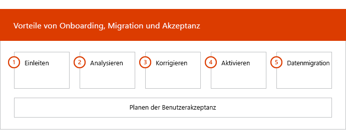

# Onboarding-PhasenOnboarding Phases

Wenn Sie die [Berechtigten Dienste und Pläne](M365-eligible-services-and-plans.md) verwenden, um Microsoft Azure Active Directory Premium, Microsoft Intune und Azure Information Protection für den Einsatz vorzubereiten, besteht der Prozess aus mehreren Phasen.When you use the [Eligible Services and Plans](M365-eligible-services-and-plans.md) to get Microsoft Azure Active Directory Premium, Microsoft Intune, and Azure Information Protection ready for use, there are several phases involved in the process. In den folgenden Abschnitten wird jede Phase des Onboarding-Prozesses beschrieben.The following sections describe each phase of the onboarding process.

Das Onboarding hat vier Hauptphasen:Onboarding has four primary phases:

## EinleitungsphaseInitiate phase

Nachdem Sie die gewünschte Anzahl von Lizenzen erworben haben, befolgen Sie die Anleitung in der E-Mail zur Kaufbestätigung, um die Lizenzen Ihrem vorhandenen oder neuen Mandanten zuzuordnen.After you purchase the appropriate number of licenses, follow the guidance from the purchase confirmation email to associate the licenses to your existing tenant or new tenant. Microsoft prüft dann Ihre Berechtigung für den FastTrack Center-Vorteil und versucht, Kontakt mit Ihnen aufzunehmen, um Unterstützung beim Onboarding anzubieten.Microsoft then verifies your eligibility for the FastTrack Center Benefit and tries to contact you to offer onboarding assistance.

> [!NOTE]
> Sie können auch Unterstützung über die [FastTrack-Website](https://go.microsoft.com/fwlink/?linkid=780698) anfordern, wenn Sie bereit sind, diese Dienste für Ihre Organisation bereitzustellen.You can also request assistance from the [FastTrack site](https://go.microsoft.com/fwlink/?linkid=780698) if you're ready to deploy these services for your organization.

### So fordern Sie Unterstützung anTo request assistance

1. Melden Sie sich bei der [FastTrack-Website](https://go.microsoft.com/fwlink/?linkid=780698) an.Sign in to the [FastTrack site](https://go.microsoft.com/fwlink/?linkid=780698).
2. Wählen Sie aus den **Schnellzugriffsaktionen** oben auf Zielseite die Option **Unterstützung für Microsoft 365 anfordern** oder auf der Bereitstellungskarte die Option **Unterstützung für Microsoft 365 anfordern** aus.Select **Request assistance for Microsoft 365** from the **quick actions** on the top of your landing page or by selecting **Request assistance for Microsoft 365** on the deploy card.
3. Füllen Sie das Formular **Anfordern von Unterstützung für Microsoft 365** aus.Complete the **Request Assistance for Microsoft 365 form**.

Sobald der Onboarding-Support begonnen hat, richten wir einen Zeitplan für Onlinebesprechungen ein.Once onboarding support starts, we'll set up a schedule of online meetings.

Als Microsoft Partner können Sie auch im Namen eines Kunden Hilfe auf der [FastTrack-Website](https://go.microsoft.com/fwlink/?linkid=780698) anfordern.Microsoft partners can also get help through the [FastTrack site](https://go.microsoft.com/fwlink/?linkid=780698) on behalf of a customer. Gehen Sie hierzu folgendermaßen vor:To do so:

1. Melden Sie sich bei der [FastTrack-Website](https://go.microsoft.com/fwlink/?linkid=780698) an.Sign in to the [FastTrack site](https://go.microsoft.com/fwlink/?linkid=780698).
2. Wählen Sie **Meine Kunden** aus.Select **My Customers**.
3. Suchen Sie nach Ihrem Kunden, oder wählen Sie ihn aus der Kundenliste aus.Search for your customer or select them from your customer list.
4. Wählen Sie **Dienste** aus.Select **Services**.
5. Füllen Sie das Formular **Anfordern von Unterstützung für Microsoft 365** aus.Complete the **Request Assistance for Microsoft 365 form**.

Sobald der Onboarding-Support beginnt, richtet FastTrack einen Zeitplan für Onlinebesprechungen ein, um den Onboarding-Prozess zu besprechen, Daten zu überprüfen und eine Auftaktbesprechung zu vereinbaren.Once the onboarding support starts, FastTrack sets up a schedule of online meetings with you to discuss the onboarding process, verify data, and set up a kick-off meeting.

## AnalysephaseAssess phase

Nachdem der Onboarding-Prozesses eingeleitet wurde, arbeitet das FastTrack Center bei der Analyse Ihrer Quellumgebung und der Anforderungen mit Ihnen zusammen.Once the onboarding process begins, the FastTrack Center works with you to assess your source environment and the requirements. Tools zur Analyse Ihrer Umgebung werden ausgeführt und FastTrack-Spezialisten begleiten Sie bei der Bewertung von lokalem Active Directory, Internetbrowsern, Betriebssystemen auf Kundengeräten, des DNS-Systems, des Netzwerks, der Infrastruktur und des Identitätsverwaltungssystems, um zu bestimmen, ob für das Onboarding Änderungen erforderlich sind.Tools are run to assess your environment, and FastTrack Specialists guide you through assessing your on-premises Active Directory, Internet browsers, client devices' operating systems, Domain Name System (DNS), network, infrastructure, and identity system to determine if any changes are required for onboarding.

Das FastTrack Center führt Sie auch zu Anleitungen, wie Sie die erfolgreiche Umsetzung der berechtigten Dienste fördern können.The FastTrack Center also connects you with guidance about how to drive successful adoption of the eligible services.

Basierend auf Ihrer aktuellen Einrichtung erstellen wir einen Korrekturplan. Nach Befolgen dieses Plans wird Ihre Quellumgebung an die Mindestanforderungen für ein erfolgreiches Onboarding für EMS oder deren einzelne Clouddienste angepasst.Based on your current setup, we provide a remediation plan that brings your source environment up to the minimum requirements for successful onboarding to EMS or its individual cloud services. Für die Korrekturphase setzen wir auch entsprechende Telefonkonferenzen an.We also set up appropriate checkpoint calls for the remediation phase.

## KorrekturphaseRemediate phase
Sie führen die Aufgaben im Korrekturplan für Ihre Quellumgebung aus, damit Sie die Anforderungen für das Onboarding der einzelnen Dienste erfüllen.You perform the tasks in the remediation plan on your source environment so that you meet the requirements for onboarding and adopting each service (as needed).

Bevor Sie die Aktivierungsphase einleiten, überprüfen wir gemeinsam die Ergebnisse der Korrekturaktivitäten, um sicherzustellen, dass Sie auf dem benötigten Stand sind.Before you begin the Enable phase, we jointly verify the outcomes of the remediation activities to make sure you're ready to proceed.

## AktivierungsphaseEnable phase
Nach Abschluss aller Korrekturaktivitäten ist der nächste Schritt im Projekt die Konfiguration der Kerninfrastruktur für die Nutzung der Dienste und die Bereitstellung jedes berechtigten EMS-Clouddiensts.When all remediation activities are complete, the project shifts to configuring the core infrastructure for service consumption and to provisioning each eligible EMS cloud service.

**Aktivierungsphase – Kernfunktionen****Enable phase - Core capabilities**

Zum Haupt-Onboarding zählen die Bereitstellung des Diensts sowie die Integration von Mandanten und Identitäten.Core onboarding involves service provisioning and tenant and identity integration. Es umfasst außerdem Schritte zur Bereitstellung einer Basis für das Onboarding von Onlinediensten wie Azure AD Premium, Intune und Azure Information Protection.It also includes steps for providing a foundation for onboarding online services like Azure AD Premium, Intune, and Azure Information Protection.

> [!NOTE]
> WAP stands for Web Application Proxy.WAP stands for Web Application Proxy. SSL stands for Secure Sockets Layer.SSL stands for Secure Sockets Layer. SDS stands for School Data Sync. For more information on SDS, see [Welcome to Microsoft School Data Sync](https://go.microsoft.com/fwlink/?linkid=871480).SDS stands for School Data Sync. For more information on SDS, see [Welcome to Microsoft School Data Sync](https://go.microsoft.com/fwlink/?linkid=871480).

> [!NOTE]
> Eine verwaltete Authentifizierungsmethode umfasst auch die Kennwort-Hashsynchronisierung.A managed authentication method includes, but is not limited to password hash synchronization. Die Identitätsintegration ist eine einmalige Aktivität und beinhaltet keine Migration oder Außerbetriebnahme vorhandener Authentifizierungsmethoden wie verwalteter oder Partner-Authentifizierungsmethoden.Identity integration is a one time activity and does not include migrating or decommissioning of existing authentication methods, such as managed or federated.

### Aktivierungsphase – Azure AD PremiumEnable phase - Azure AD Premium

Die Azure AD Premium-Umgebung kann mithilfe der Azure Active Directory Connect-Tool-Verzeichnissynchronisierung und der Active Directory-Verbunddienste (AD FS) (nach Bedarf) eingerichtet werden.The Azure AD Premium environment can be set up by using the Azure Active Directory Connect tool directory synchronization and Active Directory Federation Services (AD FS) (as needed).

Für Azure AD Premium-Szenarios, die das Synchronisieren lokaler Identitäten mit der Cloud umfassen, helfen wir Ihnen beim Hinzufügen von IT-Administratoren und Benutzern zu Ihrem Abonnement, beim Konfigurieren von Verwaltungsvoraussetzungen, beim Einrichten von Azure AD Premium, beim Einrichten der Verzeichnissynchronisierung mit verwalteter Authentifizierung und AD FS mithilfe des Azure AD Connect-Tools, beim Konfigurieren von Testbenutzern und dem Überprüfen Ihrer Hauptanwendungsfälle für den Dienst.For Azure AD Premium scenarios that include synchronizing on-premises identities to the cloud, we help you by adding IT admins and users to your subscription, configuring management prerequisites, setting up Azure AD Premium, setting up directory synchronization with managed authentication and AD FS using the Azure AD Connect tool, configuring test users, and validating your core use cases for the service.

Die Einrichtung von Azure AD Premium umfasst das Aktivieren der folgenden Features:Azure AD Premium setup includes enabling the following features:

-   Azure Active Directory Self-Service-Kennwortzurücksetzung (SSPR).Azure Active Directory Self-Service Password Reset (SSPR).

-   Azure Multi-Factor Authentication (Azure MFA).Azure Multi-Factor Authentication (Azure MFA).

-   Bis zu drei (3) oder mehr SaaS-Anwendungsintegrationen (Software as a Service) mit einmaligem Anmelden (Single Sign-On, SSO) aus dem[Azure Active Directory Marketplace](https://azure.microsoft.com/marketplace/active-directory/).Up to three (3) or more Software as a Service (SaaS) application integrations with Single Sign-On (SSO) from the [Azure Active Directory Marketplace](https://azure.microsoft.com/marketplace/active-directory/).

-   Automatische Benutzerbereitstellung für vorintegrierte SaaS-Anwendungen, wie sie in der [Liste der App-Integrationstutorials](https://docs.microsoft.com/azure/active-directory/saas-apps/tutorial-list) aufgeführt sind, beschränkt auf die ausgehende Bereitstellung.Automatic user provisioning for pre-integrated SaaS applications as listed in the [App integration tutorial list](https://docs.microsoft.com/azure/active-directory/saas-apps/tutorial-list), limited to outbound provisioning only.

-   Benutzerdefinierter Anmeldebildschirm, einschließlich Logo, Text und Bildern.Customized logon screen, including logo, text, and images.

-   Self-Service-und dynamische Gruppen (Gruppen).Self-Service and Dynamic Groups (Groups).

-   Azure Active Directory-Anwendungsproxy.Azure Active Directory Application Proxy.

-   Azure Active Directory Connect Health.Azure Active Directory Connect Health.

-   Bedingter Zugriff in Azure Active Directory Domain Services.Azure Active Directory Conditional Access.

-   Azure Active Directory Nutzungsbedingungen.Azure Active Directory Terms of Use.

-   Azure Active Directory Identity Protection.Azure Active Directory Identity Protection.

-   Azure Active Directory Privileged Identity Management.Azure Active Directory Privileged Identity Management.

-   Azure Active Directory Domain Services ugriffsüberprüfungen.Azure Active Directory Access Reviews.

-   Azure Active Directory-Kennwortschutz.Azure Active Directory Password Protection.

-   Azure Active Directory B2B.Azure Active Directory B2B.

### Aktivierungsphase – IntuneEnable phase - Intune

Für Intune führen wir Sie durch die Vorbereitungen für die Verwendung von Microsoft Intune zur Verwaltung von Geräten.For Intune, we guide you through getting ready to use Microsoft Intune to manage devices. Die genauen Schritte hängen von Ihrer Quellumgebung ab und basieren auf dem Mobilgerät und den Anforderungen an die Verwaltung mobiler Apps.The exact steps depend on your source environment and are based on your mobile device and mobile app management needs. Die Schritte können Folgendes umfassen:The steps can include:

-   Lizenzierung Ihrer Endbenutzer.Licensing your end users. Wir unterstützen Sie zudem beim Aktivieren von Volumenlizenzen für Ihren Microsoft Cloud Service-Mandanten (nach Bedarf).We also provide assistance on how to activate volume licenses for your Microsoft cloud service tenant (as needed).

-   Konfigurieren von Identitäten, die von Intune verwendet werden sollen, entweder durch Nutzung Ihres lokalen Active Directory oder von Cloud-Identitäten.Configuring identities to be used by Intune by leveraging either your on-premises Active Directory or cloud identities.

-   Hinzufügen von Benutzern zu Ihrem Intune-Abonnement, Definieren von IT-Administratorrollen und Erstellen von Benutzer- und Gerätegruppen.Adding users to your Intune subscription, defining IT admin roles, and creating user and device groups.

-   Konfigurieren Ihrer Autorität für die Verwaltung von Mobilgeräten (MDM), basierend auf Ihren Verwaltungsanforderungen, darunter:Configuring your Mobile Device Management (MDM) authority, based on your management needs, including:

    -   Festlegen von Intune als Ihre MDM-Berechtigung, wenn Intune Ihre einzige MDM-Lösung ist.Setting Intune as your MDM authority when Intune is your only MDM solution.

-   Bereitstellen von MDM-Anleitungen für Folgendes:Providing MDM guidance for:

    -   Konfiguration von Testgruppen, die zur Validierung von MDM-Verwaltungsrichtlinien verwendet werden sollen.Configuring tests groups to be used to validate MDM management policies.

    -   Konfigurieren von MDM-Verwaltungsrichtlinien und -Diensten wie:Configuring MDM management policies and services like:

        -   Anwendungsbereitstellung für jede unterstützte Plattform über Weblinks oder Deep Links.Application deployment for each supported platform through web links or deep links.

        -   Richtlinien für bedingten Zugriff.Conditional access policies.

        -   Bereitstellung von E-Mail-, Wireless-Netzwerk- und VPN-Profilen (virtuelles privates Netzwerk), wenn Sie eine bestehende Zertifizierungsstelle, Wi-Fi- oder VPN-Infrastruktur in Ihrer Organisation haben.Deployment of email, wireless networks, and virtual private network (VPN) profiles if you have an existing  certificate authority, Wi-Fi or VPN infrastructure in your organization.

        -   Einrichten des Microsoft Intune Exchange Connector (falls vorhanden).Setting up the Microsoft Intune Exchange Connector (when applicable).

        -   Verbindung zum Intune Data WarehouseConnecting to Intune Data Warehouse

        -   Integration von Intune mit:Integrating Intune with:
            -   Team Viewer für Remote-Unterstützung (Team Viewer-Abonnement erforderlich).Team Viewer for remote assistance (Team viewer subscription is required).

            -   Mobile Threat Defense (MTD)-Partnerlösungen (Mobile Threat Defense-Abonnement erforderlich).Mobile Threat Defense (MTD) partner solutions (Mobile Threat Defense subscription is required).

            -   Telecom Expense Management Solution (Telecom Expense Management Solution-Abonnement erforderlich).Telecom expense management solution (Telecom expense management solution subscription is required).

            -   Microsoft Defender Advanced Threat Protection (Windows E5- oder Microsoft 365 E5-Lizenzen erforderlich).Microsoft Defender Advanced Threat Protection (Windows E5 or Microsoft 365 E5 licenses are required).

    -   Registrieren von Geräten jeder [unterstützten Plattform](https://technet.microsoft.com/library/dn600287.aspx) bei Intune.Enrolling devices of each [supported platform](https://technet.microsoft.com/library/dn600287.aspx) to Intune.

-   Bereitstellen von App-Schutz-Anleitungen für Folgendes:Providing App Protection guidance on:

    -   Konfigurieren von App-Schutzrichtlinien für jede unterstützte Plattform.Configuring app protection policies for each supported platform.

    -   Konfigurieren von Richtlinien für bedingten Zugriff für verwaltete Apps.Configuring conditional access policies for managed apps.

    -   Adressieren entsprechender Benutzergruppen mit den obigen MAM-Richtlinien.Targeting the appropriate user groups with the above MAM policies.

    -   Verwenden von Verwendungsberichten für verwaltete Anwendungen.Using managed-applications usage reports.

-   Bereitstellen von Anleitungen zur PC-Verwaltung für Folgendes:Providing PC management guidance on:

    -   Installieren der Intune-Clientsoftware (bei Bedarf).Installing the Intune client software (when needed).

    -   Verwenden der in Intune verfügbaren Soft- und Hardwareberichte.Using the software and hardware reports available in Intune.

    > [!IMPORTANT]
    > FastTrack unterstützt nicht die klassische PC-Verwaltung von Windows 10 mit Intune.FastTrack does not support Windows 10 classic PC management with Intune. FastTrack unterstützt nur die Windows 10-Geräteverwaltung durch Intune Mobile Device Management (MDM).FastTrack only supports Windows 10 device management through Intune mobile device management (MDM).

#### Windows AutopilotWindows Autopilot

FastTrack kann die Gerätebereitstellung mit Windows Autopilot und Intune vereinfachen, indem Sie die Endbenutzer mit neuen Geräten ausstatten, ohne benutzerdefinierte Betriebssystemabbilder erstellen, verwalten und auf Ihren Geräte anwenden zu müssen.FastTrack can help you through simplifying your device provisioning with Windows Autopilot and Intune by giving new devices to your end users without the need to build, maintain and apply custom operating system images to your devices.

FastTrack unterstützt die folgenden Autopilot-Szenarios:FastTrack supports the following Autopilot scenarios:

- **Azure AD Self-Service:** Geräte werden in Azure AD aufgenommen und bei Intune registriert.**Azure AD self-service:** Devices join Azure AD and enroll into Intune. Dieses Szenario wird unterstützt, wenn Windows 10 1703 und die neuesten Versionen verwendet werden.This scenario is supported when using Windows 10 1703 and latest versions.

- **Hybrid Azure AD Self-Service:** Geräte werden sowohl in das lokale Azure AD als auch Azure AD aufgenommen und bei Intune registriert.**Hybrid AAD self-service:** Devices join both on-premises AD and Azure AD and enroll into Intune. Dieses Szenario wird unterstützt, wenn Windows 10 1809 und die neuesten Versionen verwendet werden.This scenario is supported when using Windows 10 1809 and latest versions.

- **Selbstbereitstellung:** Geräte werden automatisch in Azure AD aufgenommen.**Self-provisioning:** Devices automatically join Azure AD. Dieses Szenario wird unterstützt, wenn Windows 1809 und die neuesten Versionen verwendet werden.This scenario is supported when using Windows 1809 and latest versions.

    > [!IMPORTANT]
    > FastTrack unterstützt keine vom Konfigurations-Manager initiierten Autopilot-Szenarios.FastTrack does not support Autopilot scenarios initiated from Configuration Manager.

Die Schritte zum Einrichten von Windows Autopilot hängen von der Quellumgebung ab und können Folgendes umfassen:The steps to setup Windows Autopilot depends on your source environment and it can include:

- Konfigurieren und Einrichten von Microsoft Intune für Windows Autopilot.Configure and setup Microsoft Intune for Windows Autopilot.

- Konfigurieren von dynamischen Gruppen in Azure ADConfigure Azure AD dynamic groups

- Einfügen Ihres Firmenlogo in Azure AD.Add your Company branding into Azure AD.

- Erstellen und Zuweisen von Geräten zu Windows-Autopilot-Profilen (z.B. ein Windows-Autopilot-Profil, das die Erstellung eines lokalen Administratorkontos einschränkt).Create and assign devices to Windows Autopilot profiles (e.g a Windows Autopilot profile that restricts Local Administrator account creation).

- Passen Sie die Out-of-Box-Erfahrung (OOBE) an, um den Anforderungen der Organisation zu entsprechen.Customize the Out-of-box-experience (OOBE) to comply with organization's requirements.

- Konfigurieren der automatischen MDM-Registrierung in Azure AD und Intune.Configuring MDM Auto-enrollment in Azure AD and Intune.

#### Sicheres Bereitstellen von Outlook für iOS und AndroidDeploy Outlook for iOS and Android securely

FastTrack kann Sie unterstützen, indem es Outlook für iOS und Android in Ihrer Organisation sicher bereitstellt, um dafür zu sorgen, dass die Benutzer alle erforderlichen Apps installiert haben.FastTrack can help you by deploying Outlook for iOS and Android securely in your organization to ensure your users have all the required apps installed.

Die Schritte zur sicheren Bereitstellung von Outlook Mobile für iOS und Android mit Intune sind von der Quellumgebung abhängig und können Folgendes umfassen:The steps to securely deploy Outlook Mobile for iOS and Android with Intune depends on your source environment and it can include:

- Laden Sie Outlook für iOS und Android, Microsoft Authenticator und die Intune-Unternehmensportal-App über den Apple App Store oder Google Play Store herunter.Download Outlook for iOS and Android, Microsoft Authenticator and the Intune Company portal app via the Apple App Store or Google Play Store.
- Stellen Sie auch Anleitungen zu Folgendem bereit:Also provide guidance on setting up:
    - Bereitstellung von Outlook für iOS und Android, Microsoft Authenticator und der Intune-Unternehmensportal-App mit Intune.Outlook for iOS and Android, Microsoft Authenticator and the Intune Company portal app deployment with Intune.
    - App-SchutzrichtlinienApp protection policies
    - Richtlinien für bedingten ZugriffConditional access policies
    - App-KonfigurationsrichtlinienApp configuration policies

    > [!IMPORTANT]
    > Das FastTrack -Team unterstützt nicht die Sicherung von Outlook für iOS und Android mit Exchange-Postfachrichtlinien für Mobilgeräte.FastTrack team does not support securing Outlook for iOS and Android with Exchange mobile device mailbox policies.

#### CloudanfügungCloud-attach

FastTrack führt Sie durch die Vorbereitungen auf die Cloudanfügung bestehender Configuration Manager-Umgebungen mit Intune.FastTrack guides you through getting ready to cloud-attach existing Configuration Manager environments with Intune. Die genauen Schritte hängen von der Quellumgebung ab.The exact steps depend on your source environment. Die Schritte können Folgendes umfassen:These steps can include:

- Erläutern der Vorteile von Cloudanfügungen von Configuration Manager mit Intune.Explaining the benefits of cloud-attaching Configuration Manager with Intune.

- Lizenzierung Ihrer Endbenutzer.Licensing your end users. FastTrack unterstützt Sie zudem beim Aktivieren von Volumenlizenzen für Ihren Microsoft Cloud Service-Mandanten (nach Bedarf).FastTrack also provides assistance on how to activate volume licenses for your Microsoft cloud service tenant (as needed).

- Konfigurieren von Identitäten, die von Intune verwendet werden sollen, durch Nutzung Ihres lokalen Active Directory und von Cloudidentitäten.Configuring identities to be used by Intune by leveraging your on-premises Active Directory and cloud identities.

- Hinzufügen von Benutzern zu Ihrem Intune-Abonnement, Definieren von IT-Administratorrollen und Erstellen von Benutzer- und Gerätegruppen.Adding users to your Intune subscription, defining IT admin roles, and creating user and device groups.

- Aktivieren der Cloudanfügung in der Configuration Manager-Konsole.Enabling cloud-attach in the Configuration Manager console.

- Bereitstellen von Anleitungen zur Einrichtung der hybriden Azure Active Directory-Verknüpfung.Providing guidance setting up hybrid Azure Active Directory Join.

- Bereitstellen von Anleitungen zum Einrichten der automatischen MDM-Registrierung in Azure Active Directory Domain Services.Providing guidance on setting up Azure Active Directory for MDM auto-enrollment.

- Bereitstellen von Anleitungen zum Einrichten von Cloud Management Gateway.Providing guidance on how to set up cloud management gateway.

- Konfigurieren unterstützter Arbeitsauslastung, die Sie in Intune verschieben möchten.Configuring supported workloads that you want to switch to Intune.

- Installieren des Configuration Manager-Clients auf Geräten, die bei Intune registriert sind.Installing the Configuration Manager client on Intune-enrolled devices.

FastTrack stellt auch Anleitungen zur Förderung der erfolgreichen Umsetzung der berechtigten Dienste bereit.FastTrack also provides guidance on how to drive successful adoption of the eligible services.

 

#### Aktivierungsphase – Azure Information ProtectionEnable phase – Azure Information Protection

Kunden erhalten Anleitungen für Folgendes:Customers are provided guidance on how to: 

- Aktivierung und Konfigurierung ihres Mandanten.Activate and configure their tenant.
- Erstellung und Einrichtung von Bezeichnungen und Richtlinien.Create and set up labels and policies.
- Anwendung von Informationsschutz auf Dokumente.Apply information protection to documents. 
- Automatische Klassifizierung und Bezeichnung von Informationen in Office-Apps (wie Word, PowerPoint, Excel und Outlook), die unter Windows ausgeführt werden und den Azure Information Protection-Client verwenden.Automatically classify and label information in Office apps (like Word, PowerPoint, Excel, and Outlook) running on Windows and using the Azure Information Protection client.
- Verwendung von ruhenden Dateien mithilfe des Azure Information Protection Scanners.Use files at rest using the Azure Information Protection scanner.
- Überwachung von E-Mails während der Übertragung unter Verwendung von Exchange Online-Nachrichtenflussregeln.Monitor emails in transit using Exchange Online mail flow rules.

Anleitungen werden auch für Kunden bereitgestellt, die Schutzmaßnahmen mit Microsoft Azure AD Rights Management Services (Azure RMS), Office 365 Message Encryption (OME) und Data Loss Prevention (DLP) anwenden möchten.Guidance is also provided to customers who want to apply protection using Microsoft Azure Rights Management Services (Azure RMS), Office 365 Message Encryption (OME), and data loss prevention (DLP).

> [!NOTE]
> **Mehr Informationen** finden Sie unter[Enterprise Mobility + Security](https://www.microsoft.com/cloud-platform/enterprise-mobility).**Want to learn more?** see [Enterprise Mobility + Security](https://www.microsoft.com/cloud-platform/enterprise-mobility).

## Weitere SchritteNext steps

[FastTrack-Vorteil für EMS – Zuständigkeiten von MicrosoftFastTrack benefit for EMS - Microsoft responsibilities](EMS-fasttrack-responsibilities.md)

