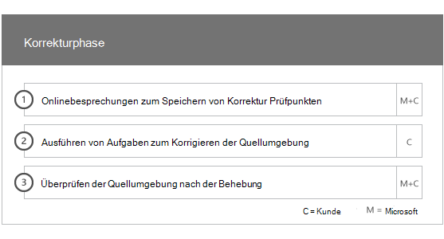

# Onboarding-PhasenOnboarding Phases

Wenn Sie die [berechtigten Dienste und Pläne](M365-eligible-services-and-plans.md) verwenden, um Microsoft Azure Active Directory Premium, Microsoft InTune und Azure Information Protection bereit zur Verwendung zu erhalten, sind mehrere Phasen am Prozess beteiligt.When you use the [Eligible Services and Plans](M365-eligible-services-and-plans.md) to get Microsoft Azure Active Directory Premium, Microsoft Intune, and Azure Information Protection ready for use, there are several phases involved in the process. In den folgenden Abschnitten werden die einzelnen Phasen des Onboarding-Prozesses beschrieben.The following sections describe each phase of the onboarding process.

Das Onboarding umfasst vier primäre Phasen:Onboarding has four primary phases:

## EinleitungsphaseInitiate phase

Nachdem Sie die entsprechende Anzahl von Lizenzen erworben haben, führen Sie die Anweisungen in der Bestätigungs-e-Mail aus, um die Lizenzen Ihrem vorhandenen Mandanten oder neuen Mandanten zuzuordnen.After you purchase the appropriate number of licenses, follow the guidance from the purchase confirmation email to associate the licenses to your existing tenant or new tenant. Microsoft überprüft dann ihre Eignung für den Vorteil des Zentrums für den Bonus Center und versucht, Sie zu kontaktieren, um Onboarding-Unterstützung anzubieten.Microsoft then verifies your eligibility for the FastTrack Center Benefit and tries to contact you to offer onboarding assistance.

> [!NOTE]
> Sie können auch Unterstützung vom [kurzcenter](https://go.microsoft.com/fwlink/?linkid=780698) anfordern, wenn Sie bereit sind, diese Dienste für Ihre Organisation bereitzustellen.You can also request assistance from the [FastTrack Center](https://go.microsoft.com/fwlink/?linkid=780698) if you're ready to deploy these services for your organization.

### So fordern Sie Hilfe anTo request assistance

1. Melden Sie sich bei der [FastTrack-Website](https://go.microsoft.com/fwlink/?linkid=780698) an.Sign in to the [FastTrack site](https://go.microsoft.com/fwlink/?linkid=780698).
2. Wählen Sie **FastTrack** aus.Select **FastTrack**.
3. Wählen Sie **Dienste** aus.Select **Services**.
4. Schließen Sie die **Anforderung für Unterstützung mit dem Microsoft 365-Formular**ab.Complete the **Request for Assistance with Microsoft 365 form**.

Sobald der Onboarding-Support gestartet wurde, richten wir einen Zeitplan für Onlinebesprechungen ein.Once onboarding support starts, we’ll set up a schedule of online meetings.

> [!NOTE]
> Wenn Sie einen Microsoft-Partner in Ihrem Office 365 Mandanten aufgeführt haben, wird diese Option nicht angezeigt.If you have a Microsoft partner listed in your Office 365 tenant, you won't see this option. Wenden Sie sich an Ihren Microsoft-Partner, um Hilfe zu erhalten.Please consult your Microsoft partner for assistance.

Microsoft-Partner können auch Hilfe über die [Website](https://go.microsoft.com/fwlink/?linkid=780698) für die Schnelligkeit im Auftrag eines Kunden erhalten.Microsoft partners can also get help through the [FastTrack site](https://go.microsoft.com/fwlink/?linkid=780698) on behalf of a customer. Gehen Sie hierzu folgendermaßen vor:To do so:

1. Melden Sie sich bei der [FastTrack-Website](https://go.microsoft.com/fwlink/?linkid=780698) an.Sign in to the [FastTrack site](https://go.microsoft.com/fwlink/?linkid=780698).
2. Wählen Sie **FastTrack** aus.Select **FastTrack**.
3. Wählen Sie **Meine Kunden** aus.Select **My Customers**.
4. Suchen Sie nach Ihrem Kunden, oder wählen Sie ihn aus der Kundenliste aus.Search for your customer or select them from your customer list.
5. Wählen Sie **Dienste** aus.Select **Services**.
6. Schließen Sie die **Anforderung für Unterstützung mit dem Microsoft 365-Formular**ab.Complete the **Request for Assistance with Microsoft 365 form**.

Sobald der Onboarding-Support gestartet wurde, richtet er einen Zeitplan für Onlinebesprechungen mit Ihnen ein, um den Onboarding-Prozess zu besprechen, Daten zu überprüfen und eine Kick-off-Besprechung einzurichten.Once the onboarding support starts, FastTrack sets up a schedule of online meetings with you to discuss the onboarding process, verify data, and set up a kick-off meeting.

## AnalysephaseAssess phase

Nachdem der Onboarding-Prozess gestartet wurde, arbeitet das "kurzcenter" mit Ihnen zusammen, um die Quellumgebung und die Anforderungen zu bewerten.Once the onboarding process begins, the FastTrack Center works with you to assess your source environment and the requirements. Tools werden ausgeführt, um Ihre Umgebung zu bewerten, und die Spezialisten für Zeitarbeits Experten führen Sie durch die Bewertung ihrer lokalen Active Directory, Internet Browser, Betriebssysteme der Clientgeräte, des DNS (Domain Name System), des Netzwerks, der Infrastruktur und des identitätssystems, um Ermitteln Sie, ob für das Onboarding Änderungen erforderlich sind.Tools are run to assess your environment, and FastTrack Specialists guide you through assessing your on-premises Active Directory, Internet browsers, client devices' operating systems, Domain Name System (DNS), network, infrastructure, and identity system to determine if any changes are required for onboarding.

Das kurzcenter verbindet Sie außerdem mit Anleitungen zum Steuern der erfolgreichen Einführung der berechtigten Dienste.The FastTrack Center also connects you with guidance about how to drive successful adoption of the eligible services.

Basierend auf Ihrem aktuellen Setup stellen wir einen Sanierungsplan bereit, der Ihre Quellumgebung auf die Mindestanforderungen für ein erfolgreiches Onboarding zu EMS oder den einzelnen Cloud-Diensten umsetzt.Based on your current setup, we provide a remediation plan that brings your source environment up to the minimum requirements for successful onboarding to EMS or its individual cloud services. Wir haben auch geeignete Prüf Punkt Aufrufe für die Korrekturphase eingerichtet.We also set up appropriate checkpoint calls for the remediation phase.

## KorrekturphaseRemediate phase
Sie führen die Aufgaben im Korrektur Plan für Ihre Quellumgebung aus, damit Sie die Anforderungen für das Onboarding und die Übernahme der einzelnen Dienste erfüllen können (je nach Bedarf).You perform the tasks in the remediation plan on your source environment so that you meet the requirements for onboarding and adopting each service (as needed).

Bevor Sie mit der Aktivierungsphase beginnen, überprüfen wir gemeinsam die Ergebnisse der Korrekturaktivitäten, um sicherzustellen, dass Sie bereit sind, fortzufahren.Before you begin the Enable phase, we jointly verify the outcomes of the remediation activities to make sure you’re ready to proceed.

## AktivierungsphaseEnable phase
Wenn alle Korrekturaktivitäten abgeschlossen sind, wird das Projekt auf die Konfiguration der Kerninfrastruktur für die Nutzung der Dienste und auf die Einrichtung jedes berechtigten EMS Cloud-Diensts verschoben.When all remediation activities are complete, the project shifts to configuring the core infrastructure for service consumption and to provisioning each eligible EMS cloud service.

**Aktivieren von Phasen Kernfunktionen****Enable phase - Core capabilities**

Zum Haupt-Onboarding zählen die Bereitstellung des Diensts sowie die Integration von Mandanten und Identitäten.Core onboarding involves service provisioning and tenant and identity integration. Es enthält auch Schritte zum Bereitstelleneiner Grundlage für Onboarding-Onlinedienste wie Azure AD Premium, InTune und Azure Information Protection.It also includes steps for providing a foundation for onboarding online services like Azure AD Premium, Intune, and Azure Information Protection.

> [!NOTE]
> WAP steht für Webanwendungsproxy SSL steht für Secure Sockets Layer SDS steht für School Data Sync Weitere Informationen zu SDS finden Sie unter [Willkommen bei Microsoft School Data Sync](https://go.microsoft.com/fwlink/?linkid=871480).WAP stands for Web Application Proxy. SSL stands for Secure Sockets Layer. SDS stands for School Data Sync. For more information on SDS, see [Welcome to Microsoft School Data Sync](https://go.microsoft.com/fwlink/?linkid=871480).

> [!NOTE]
> Eine verwaltete Authentifizierungsmethode umfasst, ist aber nicht auf die Kennworthash Synchronisierung limitiert.A managed authentication method includes, but is not limited to password hash synchronization. Die Identitätsintegration ist eine einmalige Aktivität, die nicht die Migration oder Außerbetriebnahme vorhandener Authentifizierungsmethoden, wie verwalteter oder Verbund, umfasst.Identity integration is a one time activity and does not include migrating or decommissioning of existing authentication methods, such as managed or federated.

### Aktivieren von Phase-Azure AD PremiumEnable phase - Azure AD Premium

Die Azure AD Premium-Umgebung kann mithilfe der Azure Active Directory Connect Tool-Verzeichnissynchronisierung und Active Directory Verbunddienste (AD FS) (je nach Bedarf) eingerichtet werden.The Azure AD Premium environment can be set up by using the Azure Active Directory Connect tool directory synchronization and Active Directory Federation Services (AD FS) (as needed).

Für Azure AD Premium-Szenarien, in denen lokale Identitäten für die Cloud synchronisiert werden, unterstützen wir Sie, indem wir IT-Administratoren und Benutzer zu Ihrem Abonnement hinzufügen, Verwaltungs Voraussetzungen konfigurieren, Azure AD Premium einrichten, Verzeichnis einrichten Synchronisierung mit verwalteter Authentifizierung und AD FS mithilfe des Azure AD Connect-Tools, Konfigurieren von Testbenutzern und Validieren der Kern Anwendungsfälle für den Dienst.For Azure AD Premium scenarios that include synchronizing on-premises identities to the cloud, we help you by adding IT admins and users to your subscription, configuring management prerequisites, setting up Azure AD Premium, setting up directory synchronization with managed authentication and AD FS using the Azure AD Connect tool, configuring test users, and validating your core use cases for the service.

Azure AD Premium-Setup umfasst die Aktivierung der folgenden Features:Azure AD Premium setup includes enabling the following features:

-   Azure Active Directory Self-Service Password Reset (SSPR).Azure Active Directory Self-Service Password Reset (SSPR).

-   Azure-mehrstufige Authentifizierung (Azure MFA).Azure Multi-Factor Authentication (Azure MFA).

-   Bis zu drei (3) oder mehr Software as a Service (SaaS)-Anwendungsintegration mit einmaligem Anmelden (Single Sign-on, SSO) aus dem [Azure Active Directory Marketplace](https://azure.microsoft.com/marketplace/active-directory/).Up to three (3) or more Software as a Service (SaaS) application integrations with Single Sign-On (SSO) from the [Azure Active Directory Marketplace](https://azure.microsoft.com/marketplace/active-directory/).

-   Automatische Benutzer Protestierung für vorab integrierte SaaS-Anwendungen, wie in der [Lernprogramm Liste](https://docs.microsoft.com/en-us/azure/active-directory/saas-apps/tutorial-list)für die APP-Integration aufgeführt, nur für die ausschließliche Weiterleitung beschränkt.Automatic user provisioning for pre-integrated SaaS applications as listed in the [App integration tutorial list](https://docs.microsoft.com/en-us/azure/active-directory/saas-apps/tutorial-list), limited to outbound provisioning only.

-   Benutzerdefinierter Anmeldebildschirm, einschließlich Logo, Text und Bilder.Customized logon screen, including logo, text, and images.

-   Self-Service-und dynamische Gruppen (Gruppen).Self-Service and Dynamic Groups (Groups).

-   Azure Active Directory-Anwendungs Proxy.Azure Active Directory Application Proxy.

-   Azure Active Directory Connect-Integrität.Azure Active Directory Connect Health.

-   Azure Active Directory bedingten Zugriff.Azure Active Directory Conditional Access.

-   Azure Active Directory Terms of use.Azure Active Directory Terms of Use.

-   Azure Active Directory Identity Protection.Azure Active Directory Identity Protection.

-   Azure Active Directory privilegierte Identitätsverwaltung.Azure Active Directory Privileged Identity Management.

-   Azure Active Directory Access Reviews.Azure Active Directory Access Reviews.

### Phase-InTune aktivierenEnable phase - Intune

Für InTune führen wir Sie durch die Vorbereitungen für die Verwendung von Microsoft InTune zum Verwalten von Geräten.For Intune, we guide you through getting ready to use Microsoft Intune to manage devices. Die genauen Schritte hängen von ihrer Quellumgebung ab und basieren auf Ihren Anforderungen für mobile Geräte und Mobile App Verwaltung.The exact steps depend on your source environment and are based on your mobile device and mobile app management needs. Die Schritte können Folgendes umfassen:The steps can include:

-   Lizenzierung Ihrer EndbenutzerLicensing your end users. Wir bieten auch Unterstützung bei der Aktivierung von Volumenlizenzen für Ihren Microsoft Cloud Service-Mandanten (bei Bedarf).We also provide assistance on how to activate volume licenses for your Microsoft cloud service tenant (as needed).

-   Konfigurieren von Identitäten, die von InTune verwendet werden, indem Sie entweder Ihre lokale Active Directory oder Cloud-Identitäten nutzen.Configuring identities to be used by Intune by leveraging either your on-premises Active Directory or cloud identities.

-   Hinzufügen von Benutzern zu Ihrem InTune-Abonnement, Definieren von IT-Administratorrollen und Erstellen von Benutzer-und Gerätegruppen.Adding users to your Intune subscription, defining IT admin roles, and creating user and device groups.

-   Konfigurieren der MDM-Autorität (Mobile Device Management) basierend auf Ihren Verwaltungsanforderungen, einschließlich:Configuring your Mobile Device Management (MDM) authority, based on your management needs, including:

    -   Festlegen von InTune als MDM-Autorität, wenn InTune Ihre einzige MDM-Lösung ist oder in Verbindung mit der Verwaltung mobiler Geräte für Office 365.Setting Intune as your MDM authority when Intune is your only MDM solution or is in conjunction with Mobile Device Management for Office 365.

-   Bereitstellen von MDM-Anleitungen für:Providing MDM guidance for:

    -   Konfigurieren von testsgruppen, die zur Überprüfung der MDM-Verwaltungsrichtlinien verwendet werden sollen.Configuring tests groups to be used to validate MDM management policies.

    -   Konfigurieren von MDM-Verwaltungsrichtlinien und-Diensten wie:Configuring MDM management policies and services like:

        -   Anwendungsbereitstellung für jede unterstützte Plattform über Weblinks oder Deep-Links.Application deployment for each supported platform through web links or deep links.

        -   Richtlinien für bedingten Zugriff.Conditional access policies.

        -   Bereitstellung von e-Mails, drahtlosen Netzwerken und VPN-Profilen (virtuelles privates Netzwerk), wenn Sie über eine vorhandene Zertifizierungsstelle, eine WLAN-oder VPN-Infrastruktur in Ihrer Organisation verfügen.Deployment of email, wireless networks, and virtual private network (VPN) profiles if you have an existing  certificate authority, Wi-Fi or VPN infrastructure in your organization.

        -   Einrichten des Microsoft InTune Exchange Connectors (sofern zutreffend).Setting up the Microsoft Intune Exchange Connector (when applicable).

        -   Herstellen einer Verbindung mit einem InTune-Data WarehouseConnecting to Intune Data Warehouse

        -   Integrieren von InTune mit:Integrating Intune with:
            -   TeamViewer für Remoteunterstützung (TeamViewer-Abonnement ist erforderlich).Team Viewer for remote assistance (Team viewer subscription is required).

            -   MTD-Partnerlösungen (Mobile Threat Defense) (Mobile Threat Defense Abonnement ist erforderlich).Mobile Threat Defense (MTD) partner solutions (Mobile Threat Defense subcription is required).

            -   Telecom Expense Management Solution (Telecom Expense Management Solution-Abonnement ist erforderlich).Telecom expense management solution (Telecom expense management solution subscription is required).

            -   Windows Defender Advanced Threat Protection (Windows E5-oder Microsoft 365 E5-Lizenzen sind erforderlich).Windows Defender Advanced Threat Protection (Windows E5 or Microsoft 365 E5 licenses are required).

    -   Registrieren von Geräten jeder [unterstützten Plattform](https://technet.microsoft.com/library/dn600287.aspx) für InTune.Enrolling devices of each [supported platform](https://technet.microsoft.com/library/dn600287.aspx) to Intune.

-   Bereitstellen von App-Schutz Anleitungen für:Providing App Protection guidance on:

    -   Konfigurieren von App-Schutzrichtlinien für jede unterstützte Plattform.Configuring app protection policies for each supported platform.

    -   Konfigurieren von Richtlinien für bedingten Zugriff für verwaltete apps.Configuring conditional access policies for managed apps.

    -   Ausrichtung der entsprechenden Benutzergruppen mit den oben genannten MAM-Richtlinien.Targeting the appropriate user groups with the above MAM policies.

    -   Verwenden von Verwendungsberichten für verwaltete Anwendungen.Using managed-applications usage reports.

-   Bereitstellen von Anleitungen für die PC-Verwaltung unter:Providing PC management guidance on:

    -   Installieren der InTune-Client Software (falls erforderlich).Installing the Intune client software (when needed).

    -   Verwenden der in InTune verfügbaren Software-und HardwareberichteUsing the software and hardware reports available in Intune.

    > [!IMPORTANT]
    > Die klassische PC-Verwaltung von Windows 10 mit InTune wird nicht unterstützt.FastTrack does not support Windows 10 classic PC management with Intune. Der kurzstand unterstützt Windows 10-Geräteverwaltung über die Mobile Geräteverwaltung von InTune (MDM).FastTrack only supports Windows 10 device management through Intune mobile device management (MDM).

#### Windows AutopilotWindows Autopilot

Der Kurztext kann Ihnen helfen, ihre Gerätebereitstellung mit Windows Autopilot und InTune zu vereinfachen, indem Ihren Endbenutzern neue Geräte zur Verfügung gestellt werden, ohne dass benutzerdefinierte Betriebssystemabbilder auf Ihren Geräten erstellt, verwaltet und angewendet werden müssen.FastTrack can help you through simplifying your device provisioning with Windows Autopilot and Intune by giving new devices to your end users without the need to build, maintain and apply custom operating system images to your devices.

Der Kurzkurs unterstützt die folgenden Autopilot-Szenarien:FastTrack supports the following Autopilot scenarios:

- **Azure AD Self-Service:** Geräte werden Azure AD beitreten und sich bei InTune anmelden.**Azure AD self-service:** Devices join Azure AD and enroll into Intune. Dieses Szenario wird bei Verwendung von Windows 10 1703 und den neuesten Versionen unterstützt.This scenario is supported when using Windows 10 1703 and latest versions.

- **Hybrider Aad Self-Service:** Geräte werden sowohl an lokale Ad-als auch Azure AD teilnehmen und sich bei InTune anmelden.**Hybrid AAD self-service:** Devices join both on-premises AD and Azure AD and enroll into Intune. Dieses Szenario wird bei Verwendung von Windows 10 1809 und den neuesten Versionen unterstützt.This scenario is supported when using Windows 10 1809 and latest versions.

- **Selbstverwaltung:** Geräte werden automatisch Azure AD beitreten.**Self-provisioning:** Devices automatically join Azure AD. Dieses Szenario wird bei Verwendung von Windows 1809 und den neuesten Versionen unterstützt.This scenario is supported when using Windows 1809 and latest versions.

    > [!IMPORTANT]
    > In diesem Fall werden Autopilot-Szenarien, die von Configuration Manager initiiert wurden, nicht unterstützt.FastTrack does not support Autopilot scenarios initiated from Configuration Manager.

Die Schritte zum Einrichten von Windows Autopilot hängen von der Quellumgebung ab und können Folgendes umfassen:The steps to setup Windows Autopilot depends on your source environment and it can include:

- Konfigurieren und Einrichten von Microsoft InTune für Windows Autopilot.Configure and setup Microsoft Intune for Windows Autopilot.

- Konfigurieren Azure AD dynamischer GruppenConfigure Azure AD dynamic groups

- Fügen Sie Ihr Firmenbranding in Azure AD hinzu.Add your Company branding into Azure AD.

- Erstellen und Zuweisen von Geräten zu Windows Autopilot-Profilen (beispielsweise ein Windows Autopilot-Profil, das die Erstellung lokaler Administrator Konten einschränkt).Create and assign devices to Windows Autopilot profiles (e.g a Windows Autopilot profile that restricts Local Administrator account creation).

- Passen Sie die Out-of-Box-Experience (OOBE) an, um den Anforderungen der Organisation zu entsprechen.Customize the Out-of-box-experience (OOBE) to comply with organization's requirements.

- Konfigurieren der automatischen MDM-Registrierung in Azure AD und InTune.Configuring MDM Auto-enrollment in Azure AD and Intune.

#### Sicheres Bereitstellen von Outlook für IOS und AndroidDeploy Outlook for iOS and Android securely

Der Kurztext kann Ihnen helfen, indem Sie Outlook für IOS und Android sicher in Ihrer Organisation bereitstellen, um sicherzustellen, dass Ihre Benutzer alle erforderlichen apps installiert haben.FastTrack can help you by deploying Outlook for iOS and Android securely in your organization to ensure your users have all the required apps installed.

Die Schritte zur sicheren Bereitstellung von Outlook Mobile für IOS und Android mit InTune hängen von der Quellumgebung ab und können Folgendes umfassen:The steps to securely deploy Outlook Mobile for iOS and Android with Intune depends on your source environment and it can include:

- Laden Sie Outlook für IOS und Android, Microsoft Authenticator und die Intune-Unternehmensportal-App über den Apple App Store oder den Google Play Store herunter.Download Outlook for iOS and Android, Microsoft Authenticator and the Intune Company portal app via the Apple App Store or Google Play Store.
- Geben Sie außerdem Anleitungen zum Einrichten von:Also provide guidance on setting up:
    - Outlook für IOS und Android, Microsoft Authenticator und die APP-Bereitstellung des InTune-Unternehmensportals mit InTune.Outlook for iOS and Android, Microsoft Authenticator and the Intune Company portal app deployment with Intune.
    - Richtlinien für den App-SchutzApp protection policies
    - Richtlinien für bedingten ZugriffConditional access policies
    - App-KonfigurationsrichtlinienApp configuration policies

    > [!IMPORTANT]
    > Das Team des Teams unterstützt das Sichern von Outlook für IOS und Android mit Postfachrichtlinien für mobile Geräte von Exchange nicht.FastTrack team does not support securing Outlook for iOS and Android with Exchange mobile device mailbox policies.

#### Gemeinsame VerwaltungCo-management

Der Schnellstart führt Sie durch die Vorbereitungen zur gleichzeitigen Verwaltung von Windows 10-Geräten mit Configuration Manager und InTune.FastTrack guides you through getting ready to concurrently manage Windows 10 devices with both Configuration Manager and Intune. Die genauen Schritte hängen von ihrer Quellumgebung ab und können Folgendes umfassen:The exact steps depend on your source environment, and it can include:

- Erläutern Sie die Vorteile der gemeinsamen Verwaltung.Explain the benefits of Co-management.

- Lizenzieren Sie Ihre Endbenutzer.License your end users. Darüber hinaus unterstützt Sie die Aktivierung von Volumenlizenzen für Ihren Microsoft Cloud Service-Mandanten (nach Bedarf).FastTrack also provides assistance on how to activate volume licenses for your Microsoft cloud service tenant (as needed).

- Konfigurieren Sie Identitäten, die von InTune verwendet werden sollen, indem Sie entweder Ihre lokalen Active Directory und/oder Cloud-Identitäten nutzen.Configure identities to be used by Intune by leveraging either your on-premises Active Directory and/or cloud identities.

- Hinzufügen von Benutzern zu Ihrem InTune-Abonnement, Definieren von IT-Administratorrollen und Erstellen von Benutzer-und Gerätegruppen.Adding users to your Intune subscription, defining IT admin roles, and creating user and device groups.

- Geben Sie Anleitungen zum Umstieg von InTune in System Center Configuration Manager (Hybrid) in InTune Standalone.Provide guidance on how to move from Intune integrated with System Center Configuration Manager (Hybrid) to Intune Standalone.

- Leitfaden zum Einrichten von Azure Active Directory für die automatische MDM-Registrierung.Provide guidance on setting up Azure Active Directory for MDM auto-enrollment.

- Bereitstellen von Anleitungen zum Einrichten von Hybrid-Azure-Active Directory Join.Provide guidance setting up hybrid Azure Active Directory Join.

- Bereitstellen von Anleitungen zum Einrichten des Cloud Management-GatewaysProvide guidance on how to set up Cloud Management Gateway

- Aktivieren Sie die gemeinsame Verwaltung in der Configuration Manager-Konsole.Enable Co-management in Configuration Manager console.

- Konfigurieren Sie die unterstützten Arbeitsauslastungen, die Sie zu InTune wechseln möchten.Configure supported workloads that you want to switch to Intune.

- Installieren Sie den Configuration Manager-Client in InTune-registrierten Geräten.Install Configuration Manager client in Intune enrolled devices.

- Geben Sie Anleitungen zum Überwachen der gemeinsamen Verwaltungsaktivitäten in Ihrer Umgebung.Provide guidance on how to monitor the Co-management activity in your environment.

Außerdem erhalten Sie eine Anleitung, wie Sie die erfolgreiche Einführung der berechtigten Dienste vorantreiben können.FastTrack also provides you guidance on how to drive successful adoption of the eligible services.

#### Aktivierungsphase – Azure Information ProtectionEnable phase – Azure Information Protection

Kunden werden Anleitungen zu folgenden Themen bereitgestellt:Customers are provided guidance on how to: 

- Aktivieren und konfigurieren Sie den Mandanten.Activate and configure their tenant.
- Erstellen und Einrichten von Bezeichnungen und RichtlinienCreate and set up labels and policies.
- Wenden Sie den Schutz von Informationen auf Dokumente an.Apply information protection to documents. 
- Automatisches klassifizieren und bezeichnen von Informationen in Office-Apps (wie Word, PowerPoint, Excel und Outlook), die unter Windows unter Verwendung des Azure Information Protection-Clients durchführen.Automatically classify and label information in Office apps (like Word, PowerPoint, Excel, and Outlook) running on Windows and using the Azure Information Protection client.
- Verwenden Sie Dateien im Ruhezustand mithilfe des Azure Information Protection-Scanners.Use files at rest using the Azure Information Protection scanner.
- Überwachen von e-Mails in Transit mit Exchange Online Nachrichtenfluss Regeln.Monitor emails in transit using Exchange Online mail flow rules.

Kunden, die den Schutz mithilfe von Microsoft Azure Rights Management Services (Azure RMS), der Office 365-Nachrichtenverschlüsselung (OM) und der Verhinderung von Datenverlust (DLP) anwenden möchten, werden ebenfalls Unterstützung angeboten.Guidance is also provided to customers who want to apply protection using Microsoft Azure Rights Management Services (Azure RMS), Office 365 Message Encryption (OME), and data loss prevention (DLP).

> [!NOTE]
> **Möchten Sie mehr erfahren?** Weitere Informationen finden Sie unter [Enterprise Mobility + Security](https://www.microsoft.com/en-us/cloud-platform/enterprise-mobility).**Want to learn more?** see [Enterprise Mobility + Security](https://www.microsoft.com/en-us/cloud-platform/enterprise-mobility).

## Nächste SchritteNext steps

[Kurzgeld für EMS-Microsoft-AufgabenFastTrack benefit for EMS - Microsoft responsibilities](EMS-fasttrack-responsibilities.md)
