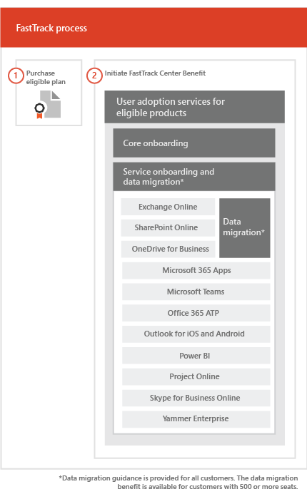

# Der FastTrack-ProzessThe FastTrack Process

> [!CAUTION]
> Dieser Inhalt ist nicht mehr aktuell, und seine Entfernung ist geplant.This content is no longer current and is scheduled for removal. Verwenden Sie das Inhaltsverzeichnis in der linken Navigation, um sich über aktuelle Inhalte zu informieren.Use the table of contents in the left-hand navigation for current content.

Der FastTrack-Prozess stellt Dienste für Onboarding und Benutzerakzeptanz bereit. The FastTrack process provides onboarding and user adoption services. 
  
Das Onboarding besteht aus:Onboarding consists of:
  
- *Haupt-Onboarding* – Umfasst die Aufgaben, die bei Bedarf für die Mandantenkonfiguration und die Integration mit Azure Active Directory (Azure AD) ausgeführt werden müssen. Das Haupt-Onboarding stellt auch die Grundlage für das Onboarding anderer berechtigter Dienste dar.*Core onboarding* — These are tasks required for tenant configuration and integration with Azure Active Directory (Azure AD) if needed. Core onboarding also provides the baseline for onboarding other eligible services. 
- *Dienst-Onboarding und -Migration* – Dienst-Onboardingaktivitäten ermöglichen Szenarios in Ihrem Mandanten. Die Migration von Daten (einschließlich E-Mails und Dateien) wird unter [Datenmigration](O365-data-migration.md) behandelt. *Service onboarding and migration* — Service onboarding tasks enable scenarios in your tenant. Data migration (including email and files) is covered in [Data Migration](O365-data-migration.md). 
    
Die Dienste für die Benutzerakzeptanz bestehen aus Aufgaben, die Ihnen eine Anleitung bereitstellen, wie Sie sicherstellen, dass die Benutzer die jeweiligen Dienste kennen und sie zum Erzielen geschäftlicher Vorteile nutzen können. Diese Unterstützung erfolgt parallel zu den Onboarding-Aktivitäten.User adoption services are comprised of tasks that provide guidance for you to ensure your users are aware of the eligible services and can use them to drive business value. This assistance occurs in parallel to onboarding activities.
  
> [!NOTE]
> FastTrack bietet Kunden einen empfohlenen Ansatz, Anleitungen und bewährte Methoden für schnelle und vorhersehbare Ergebnisse. Wenn Sie nicht entsprechend dieser Anleitungen bereitstellen, werden die Onboarding-Erfahrung und die Verwendung dieses Diensts möglicherweise beeinträchtigt. Eine Anleitung wird als eine Kombination aus mündlicher und schriftlicher Unterstützung definiert. Wenn FastTrack-Experten eine Anleitung bereitstellen, können FastTrack-Mitarbeiter nicht in Ihrem Auftrag handeln. Sie können FastTrack-Dienste für Onboarding und Benutzerakzeptanz für alle qualifizierenden Produktarbeitsauslastungen verwenden, solange Ihr Abonnement gültig ist. FastTrack provides customers with a recommended approach, guidance, and best practices engineered to deliver quick and predictable outcomes. If you choose to deploy outside of this guidance, your onboarding experience and usage of the service may be impacted. Guidance is defined as a combination of verbal and written assistance. When FastTrack Specialists provide guidance, FastTrack personnel cannot act on your behalf. You can use FastTrack services to onboard and adopt any qualifying product workload as long as your subscription is current. 
  
## Der Onboarding-ProzessThe onboarding process

In der folgenden Abbildung wird der Onboarding-Prozess dargestellt.The following diagram illustrates the onboarding process.
  

  
Sie erhalten über das [Microsoft 365 Admin Center](https://go.microsoft.com/fwlink/?linkid=2032704) oder die [FastTrack-Website](https://go.microsoft.com/fwlink/?linkid=780698) Unterstützung.You can get help through the [Microsoft 365 admin center](https://go.microsoft.com/fwlink/?linkid=2032704) or the [FastTrack site](https://go.microsoft.com/fwlink/?linkid=780698). 

Für Unterstützung über das  [Microsoft 365 Admin Center](https://go.microsoft.com/fwlink/?linkid=2032704) muss Ihr Administrator sich dort anmelden und anschließend auf das Widget **Need help?** klicken.To get help through the [Microsoft 365 admin center](https://go.microsoft.com/fwlink/?linkid=2032704), your admin signs into the admin center and then clicks the **Need help?** widget. 

So erhalten Sie Unterstützung über die [FastTrack-Website](https://go.microsoft.com/fwlink/?linkid=780698):To get help through the [FastTrack site](https://go.microsoft.com/fwlink/?linkid=780698): 
1.    Melden Sie sich bei der [FastTrack-Website](https://go.microsoft.com/fwlink/?linkid=780698) an.Sign in to the [FastTrack site](https://go.microsoft.com/fwlink/?linkid=780698). 
2.    Wählen Sie oben auf Ihrer Startseite in **Schnelle Aktionen** die Option **Anfordern von Unterstützung bei Microsoft 365** aus.Select **Request assistance with Microsoft 365** from the **quick actions** on the top of your landing page.
3.    Füllen Sie das Formular **Anfordern von Unterstützung bei Microsoft 365** aus.Complete the **Request Assistance with Microsoft 365** form.
  
Als Partner können Sie auch im Namen eines Kunden Hilfe auf der [FastTrack-Website](https://go.microsoft.com/fwlink/?linkid=780698) anfordern. Gehen Sie dazu wie folgt vor:Partners can also get help through the [FastTrack site](https://go.microsoft.com/fwlink/?linkid=780698) on behalf of a customer. To do so:
1.    Melden Sie sich bei der [FastTrack-Website](https://go.microsoft.com/fwlink/?linkid=780698) an.Sign in to the [FastTrack site](https://go.microsoft.com/fwlink/?linkid=780698). 
2.    Wählen Sie oben auf Ihrer Startseite in **Schnelle Aktionen** die Option **Anfordern von Unterstützung bei Microsoft 365** aus.Select **Request assistance with Microsoft 365** from the **quick actions** on the top of your landing page.
3.    Suchen Sie nach Ihrem Kunden, indem Sie den Kundennamen, die Domäne oder die TPID eingeben.Search for your customer by entering the customer name, domain, or TPID.
4.    Wählen Sie den Kunden aus den Suchergebnissen aus.Select customer from the search results.
5.    Füllen Sie das Formular **Anfordern von Unterstützung bei Microsoft 365** aus.Complete the **Request Assistance with Microsoft 365** form.
  
 Sie können auch über die [FastTrack-Website](https://go.microsoft.com/fwlink/?linkid=780698) in der Liste der verfügbaren Dienste für Ihren Mandanten Hilfe zu FastTrack Center anfordern. You can also ask for FastTrack Center help from the [FastTrack site](https://go.microsoft.com/fwlink/?linkid=780698) in the list of available services for your tenant. 
    
 Sobald die Onboarding-Unterstützung begonnen hat, richten wir einen Zeitplan für Onlinebesprechungen ein.Once onboarding assistance starts, we set up a schedule of online meetings.

In der folgenden Tabelle sind Rollen und Verantwortlichkeiten für den Prozess aufgeführt.The following table lists roles and responsibilities for the process.
    
|||
|:-----|:-----|
|**Rolle****Role**   |**Zuständigkeit****Responsibility**   |
|**FastTrack-Spezialist****FastTrack Specialist**   |Stellt alle Dienste für Onboarding, Migration und die Benutzerakzeptanz remote bereit.Provides all onboarding, migration, and user adoption services remotely.    Unterstützt Sie remote mithilfe einer Kombination aus Tools und veröffentlichter Dokumentation.Assists you remotely by using a combination of tools and published documentation.   Arbeitet direkt mit Ihnen oder Ihrem Bevollmächtigten zusammen.Works directly with you or your representative.   Unterstützt Sie bei der E-Mail- und Datenmigration.Provides email and data migration guidance.|
|**FastTrack Center****FastTrack Center**    |Bietet Anleitung für das Onboarding und die Planung der erfolgreichen Einführung der Dienste.Provides guidance with core and service onboarding and planning successful adoption of eligible services.    Bietet Unterstützung und steht in der jeweiligen Region zu den üblichen Geschäftszeiten zur Verfügung.Provides assistance and is available during normal business hours for a given region.   Bietet Unterstützung in den folgenden Sprachen: Deutsch, Englisch, Französisch, Italienisch, Japanisch, Koreanisch, Portugiesisch (Brasilien), Spanisch, Thai, Vietnamesisch, traditionelles Chinesisch und Chinesisch (vereinfacht) (Ressourcen sprechen nur Mandarin).Provides assistance in Traditional Chinese and Simplified Chinese (resources speak Mandarin only), English, French, German, Italian, Japanese, Korean, Portuguese (Brazil), Spanish, Thai, and Vietnamese.|
