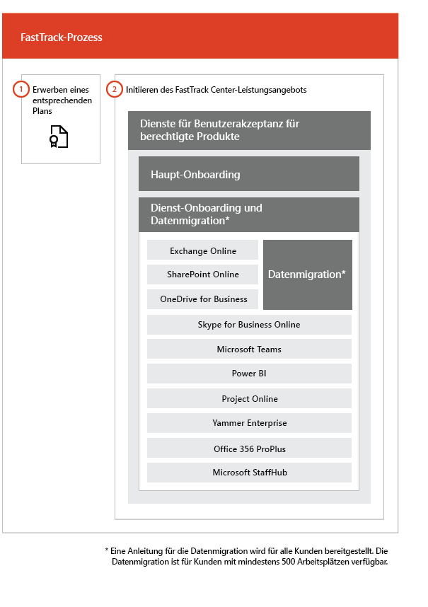

# Der FastTrack-Prozess

Der FastTrack-Prozess stellt Dienste für Onboarding und Benutzerakzeptanz bereit.  
  
Das Onboarding besteht aus:
  
- *Haupt-Onboarding* – Umfasst die Aufgaben, die bei Bedarf für die Mandantenkonfiguration und die Integration mit Azure Active Directory (Azure AD) ausgeführt werden müssen. Das Haupt-Onboarding stellt auch die Grundlage für das Onboarding anderer berechtigter Dienste dar. 
- *Dienst-Onboarding und -Migration* – Dienst-Onboardingaktivitäten ermöglichen Szenarios in Ihrem Mandanten. Die Migration von Daten (einschließlich E-Mails und Dateien) wird unter [Datenmigration](O365-data-migration.md) behandelt.  
    
Die Dienste für die Benutzerakzeptanz bestehen aus Aufgaben, die Ihnen eine Anleitung bereitstellen, wie Sie sicherstellen, dass die Benutzer die jeweiligen Dienste kennen und sie zum Erzielen geschäftlicher Vorteile nutzen können. Diese Unterstützung erfolgt parallel zu den Onboarding-Aktivitäten.
  
> [!NOTE]
> FastTrack bietet Kunden einen empfohlenen Ansatz, Anleitungen und bewährte Methoden für schnelle und vorhersehbare Ergebnisse. Wenn Sie nicht entsprechend dieser Anleitungen bereitstellen, werden die Onboarding-Erfahrung und die Verwendung dieses Diensts möglicherweise beeinträchtigt. Eine Anleitung wird als eine Kombination aus mündlicher und schriftlicher Unterstützung definiert. Wenn FastTrack-Experten eine Anleitung bereitstellen, können FastTrack-Mitarbeiter nicht in Ihrem Auftrag handeln. Sie können FastTrack-Dienste für Onboarding und Benutzerakzeptanz für alle qualifizierenden Produktarbeitsauslastungen verwenden, solange Ihr Abonnement gültig ist.  
  
## Der Onboarding-Prozess

In der folgenden Abbildung wird der Onboarding-Prozess dargestellt.
  

  
Sie erhalten über das [Microsoft 365 Admin Center](https://go.microsoft.com/fwlink/?linkid=2032704) oder die [FastTrack-Website](https://go.microsoft.com/fwlink/?linkid=780698) Unterstützung. 

Für Unterstützung über das [Microsoft 365 Admin Center](https://go.microsoft.com/fwlink/?linkid=2032704) muss Ihr Administrator sich dort anmelden und anschließend auf das Widget **Need help?** klicken. 

So erhalten Sie Unterstützung über die [FastTrack-Website](https://go.microsoft.com/fwlink/?linkid=780698): 
1.    Melden Sie sich bei der [FastTrack-Website](https://go.microsoft.com/fwlink/?linkid=780698) an. 
2.    Wählen Sie aus den **Schnellzugriffsaktionen** oben auf Zielseite die Option **Unterstützung für Microsoft 365 anfordern** oder auf der Bereitstellungskarte die Option **Unterstützung für Microsoft 365 anfordern** aus.
3.    Füllen Sie das Formular **Anfordern von Unterstützung für Microsoft 365** aus. 
  
 Sie können auch über die [FastTrack-Website](https://go.microsoft.com/fwlink/?linkid=780698) in der Liste der verfügbaren Dienste für Ihren Mandanten Hilfe zu FastTrack Center anfordern.  
    
 Sobald die Onboarding-Unterstützung begonnen hat, richten wir einen Zeitplan für Onlinebesprechungen ein.
    
Als Partner können Sie auch im Namen eines Kunden Hilfe auf der [FastTrack-Website](https://go.microsoft.com/fwlink/?linkid=780698) anfordern. Gehen Sie dazu wie folgt vor:
1.    Melden Sie sich bei der [FastTrack-Website](https://go.microsoft.com/fwlink/?linkid=780698) an. 
2.    Wählen Sie **Meine Kunden** aus.
3.    Suchen Sie nach Ihrem Kunden, oder wählen Sie ihn aus der Kundenliste aus.
4.    Wählen Sie **Dienste** aus.
5.    Füllen Sie das Formular **Anfordern von Unterstützung für Microsoft 365** aus. 

In der folgenden Tabelle sind Rollen und Verantwortlichkeiten für den Prozess aufgeführt.
    
|||
|:-----|:-----|
|**Rolle**   |**Zuständigkeit**   |
|**FastTrack-Spezialist**   |Stellt alle Dienste für Onboarding, Migration und die Benutzerakzeptanz remote bereit.    Unterstützt Sie remote mithilfe einer Kombination aus Tools und veröffentlichter Dokumentation.   Arbeitet direkt mit Ihnen oder Ihrem Bevollmächtigten zusammen.   Unterstützt Sie bei der E-Mail- und Datenmigration.|
|**FastTrack Center**    |Bietet Anleitung für das Onboarding und die Planung der erfolgreichen Einführung der Dienste.    Bietet Unterstützung und steht in der jeweiligen Region zu den üblichen Geschäftszeiten zur Verfügung.   Bietet Unterstützung in den folgenden Sprachen: Deutsch, Englisch, Französisch, Italienisch, Japanisch, Koreanisch, Portugiesisch (Brasilien), Spanisch, Thai, Vietnamesisch, traditionelles Chinesisch und Chinesisch (vereinfacht) (Ressourcen sprechen nur Mandarin).|
