# Phasen im Onboarding- und Migrationsprozess

Das Onboarding von Office 365 besteht aus vier Phasen: Einleitung, Analyse, Korrektur und Aktivierung. Sie können diesen Phasen noch eine optionale Phase zur Datenmigration folgen lassen, wie in der folgenden Abbildung gezeigt.
  
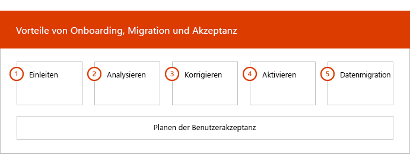
  
> [!NOTE]
>Informationen zu Onboarding und Migration für Office 365 US Government finden Sie unter [Onboarding and Migration for Office 365 US Government](US-Gov-appendix-onboarding-and-migration.md). 

Detaillierte Aufgaben für jede Phase finden Sie unter [FastTrack-Zuständigkeiten](O365-fasttrack-responsibilities.md) und [Ihre Zuständigkeiten](O365-your-responsibilities.md).
  
## Einleitungsphase

Nachdem Sie die gewünschte Anzahl und die gewünschten Typen von Lizenzen erworben haben, müssen Sie die Anleitung in der E-Mail zur Kaufbestätigung befolgen, um die Lizenzen Ihrem vorhandenen oder neuen Mandanten zuzuordnen. 
  
Sie erhalten über das [Microsoft 365 Admin Center](https://go.microsoft.com/fwlink/?linkid=2032704) oder die [FastTrack-Website](https://go.microsoft.com/fwlink/?linkid=780698) Unterstützung. 

Für Unterstützung über das [Microsoft 365 Admin Center](https://go.microsoft.com/fwlink/?linkid=2032704) muss Ihr Administrator sich dort anmelden und anschließend auf das Widget **Need help?** klicken. 

So erhalten Sie Unterstützung über die [FastTrack-Website](https://go.microsoft.com/fwlink/?linkid=780698): 
1.  Melden Sie sich bei der [FastTrack-Website](https://go.microsoft.com/fwlink/?linkid=780698) an. 
2.  Wählen Sie **Dienste** aus.
3.  Füllen Sie das Formular **Antrag auf Unterstützung bei Microsoft 365** aus. 
  
Als Partner können Sie auch im Namen eines Kunden Hilfe auf der [FastTrack-Website](https://go.microsoft.com/fwlink/?linkid=780698) anfordern. Gehen Sie dazu wie folgt vor:
1.  Melden Sie sich bei der [FastTrack-Website](https://go.microsoft.com/fwlink/?linkid=780698) an. 
2.  Wählen Sie **Meine Kunden** aus.
3.  Suchen Sie nach Ihrem Kunden, oder wählen Sie ihn aus der Kundenliste aus.
4.  Wählen Sie **Dienste** aus.
5.  Füllen Sie das Formular **Antrag auf Unterstützung bei Microsoft 365** aus.

Sie können auch über die [FastTrack-Website](https://go.microsoft.com/fwlink/?linkid=780698) in der Liste der verfügbaren Dienste für Ihren Mandanten Hilfe zu FastTrack Center anfordern.  
    
In dieser Phase werden der Onboarding-Prozess beschrieben, Ihre Daten überprüft und eine Einführungsbesprechung angesetzt. Dabei arbeiten wir Ihnen zusammen, um mehr über die beabsichtigte Nutzung des Diensts und die Ziele und Pläne Ihrer Organisation zur Steigerung der Nutzung des Diensts zu erfahren.
  
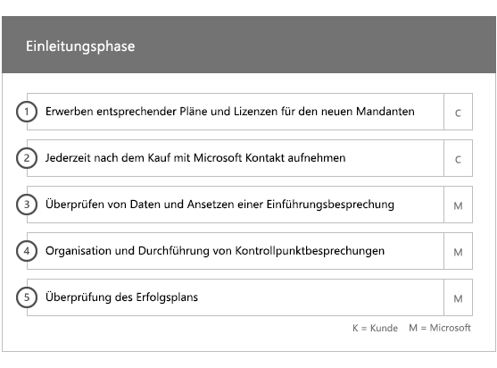
  
## Analysephase

Ihr FastTrack Manager führt mit Ihnen und dem Einführungsteam ein interaktives Planungsgespräch. Dabei werden Ihnen die Funktionen der erworbenen Dienste, die wichtigsten Grundlagen für Ihren Erfolg, die Methodik zur Steigerung der Nutzung des Service und verschiedene Szenarios vorgestellt, wie Sie einen Nutzen aus den Diensten ziehen können. Wir unterstützen Sie bei der Erfolgsplanung und liefern, soweit erforderlich, Feedback zu wichtigen Bereichen.
  
FastTrack-Spezialisten analysieren gemeinsam mit Ihnen Ihre Quellumgebung und Ihre Anforderungen. Wir stellen Tools bereit, mit denen Sie Daten zu Ihrer Umgebung erfassen können, und helfen Ihnen bei der Einschätzung der Bandbreitenanforderungen sowie der Evaluierung Ihrer Internetbrowser und Clientbetriebssysteme, Ihres DNS (Domain Name System), Ihres Netzwerks, Ihrer Infrastruktur und Ihres Identitätsverwaltungssystems. So ermitteln wir, ob für das Onboarding Änderungen implementiert werden müssen. 
  
Basierend auf Ihrer aktuellen Einrichtung erstellen wir einen Korrekturplan. Nach Befolgen dieses Plans wird Ihre Quellumgebung an die Mindestanforderungen für ein erfolgreiches Onboarding für Office 365 und bei Bedarf eine erfolgreiche Postfach- und/oder Datenmigration angepasst. Wir stellen verschiedene mögliche Maßnahmen zur Verfügung, mit denen sich der Nutzen für Endbenutzer und die Akzeptanz durch diese steigern lassen. Für die Korrekturphase setzen wir auch entsprechende Telefonkonferenzen an.
  
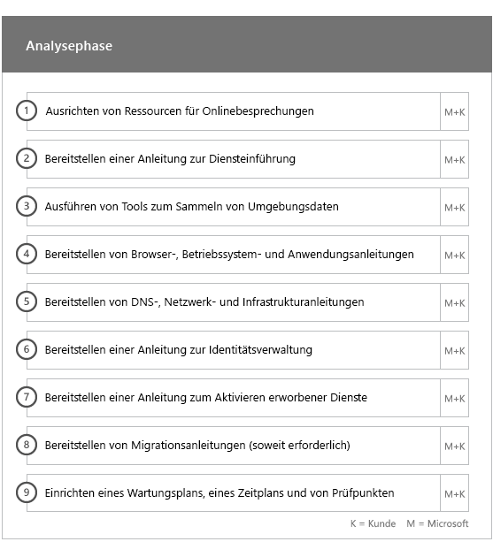
  
## Korrekturphase

Sie führen die Aufgaben im Korrekturplan für Ihre Quellumgebung aus, damit Sie die Anforderungen für das Onboarding, die Anpassung und die Migration der einzelnen Dienste erfüllen.
  
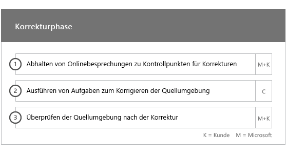
  
Wir stellen außerdem verschiedene mögliche Maßnahmen zur Verfügung, mit denen sich der Nutzen für Endbenutzer und die Akzeptanz durch diese steigern lassen. Vor Einleiten der Aktivierungsphase überprüfen wir gemeinsam die Ergebnisse der Korrekturaktivitäten, um sicherzustellen, dass Sie auf dem benötigten Stand sind. 
  
In dieser Phase arbeitet der FastTrack Manager mit Ihnen an der Erfolgsplanung und unterstützt Sie durch Anleitung bei der Wahl der richtigen Ressourcen und bewährten Methoden, mit denen Sie den Dienst in Ihrer Organisation zur Verfügung stellen und die Nutzung aller Dienste steigern können.
  
## Aktivierungsphase

Nach Abschluss aller Korrekturaktivitäten ist der nächste Schritt im Projekt die Konfiguration der Kerninfrastruktur für die Nutzung der Dienste, die Bereitstellung von Office 365 und das Ausführen von Aktivitäten zur Unterstützung der Diensteinführung. 
  
## Haupt-Onboarding

Zum Haupt-Onboarding zählen die Bereitstellung des Diensts sowie die Integration von Mandanten und Identitäten. Ferner gehören dazu grundlegende Schritte für das Onboarding von Diensten wie Exchange Online, SharePoint Online und Skype for Business Online. Es finden weiterhin Besprechungen zur Erfolgsplanung mit Ihrem FastTrack Manager statt, in denen Sie Ihren Fortschritt bewerten und bestimmen, wie wir Sie in der Zukunft unterstützen können.
  
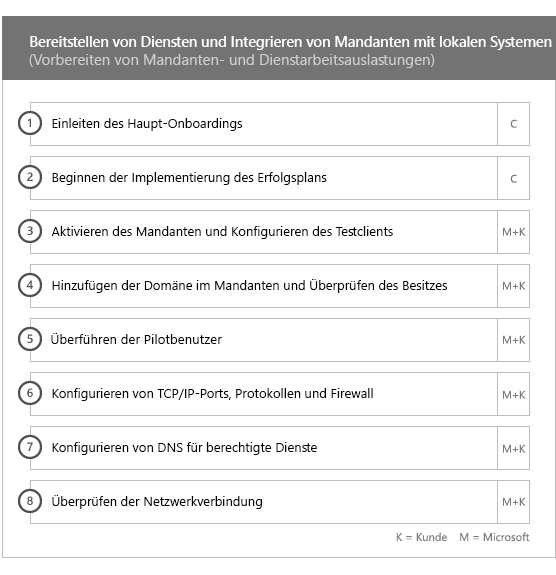
  
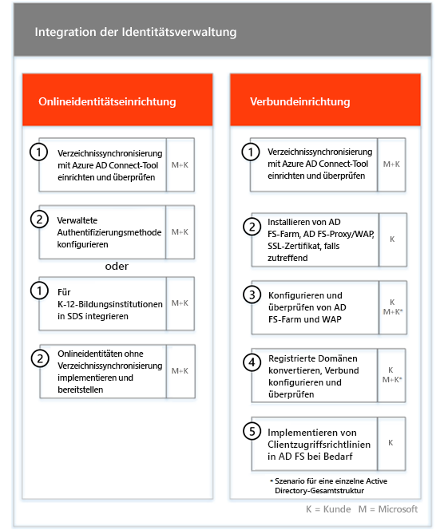
  
> [!NOTE]
> WAP steht für Webanwendungsproxy SSL steht für Secure Sockets Layer SDS steht für School Data Sync Weitere Informationen zu SDS finden Sie unter [Willkommen bei Microsoft School Data Sync](https://go.microsoft.com/fwlink/?linkid=871480). 
  
Das Onboarding für einen oder mehrere berechtigte Dienste kann beginnen, sobald das Haupt-Onboarding abgeschlossen ist.
  
## Exchange Online

Bei Exchange Online leiten wir Sie durch den Vorgang, die Verwendung von E-Mail für Ihre Organisation einzurichten. Welche Schritte genau dazu notwendig sind, hängt von Ihrer Quellumgebung und Ihren E-Mail-Migrationsplänen ab. Dies können unter anderem die folgenden Schritte sein:
- Einrichten von Exchange Online Protection (EOP)-Funktionen für alle E-Mail-aktivierten Domänen, die in Office 365 überprüft wurden.
    > [!NOTE]
    > Ihre MX-Einträge (Mail Exchange) müssen auf Office 365 verweisen. 
- Einrichten der Office 365 Advanced Threat Protection (ATP)-Funktion, wenn diese Bestandteil Ihres Abonnementdiensts ist. Weitere Informationen finden Sie unter [Office 365 Advanced Threat Protection](#office-365-advanced-threat-protection).
- Einrichten der Verhinderung von Datenverlust (Data Loss Prevention, DLP) für alle E-Mail-aktivierten Domänen, die in Office 365 als Teil Ihres Abonnementdiensts validiert wurden. Dies geschieht, sobald Ihre MX-Einträge auf Office 365 verweisen.
- Einrichten der Office 365-Nachrichtenverschlüsselung (OME) für alle E-Mail-aktivierten Domänen, die in Office 365 als Teil Ihres Abonnementdiensts validiert wurden. Dies geschieht, sobald Ihre MX-Einträge auf Office 365 verweisen.

> [!NOTE]
> Der Postfachreplikationsdienst (Mailbox Replication Service, MRS) versucht, IRM-E-Mails (Information Rights Managed) aus dem lokalen Postfach in das entsprechende Exchange Online-Postfach zu migrieren. Die Möglichkeit, die geschützten Inhalte nach der Migration zu lesen, hängt von der Kundenzuordnung und dem Kopieren von AD RMS-Vorlagen (Active Directory Rights Managed Services) zum Azure RMS-Dienst (Azure Rights Management) ab.

- Konfigurieren von Firewallports.
- Einrichten von DNS, einschließlich der erforderlichen AutoErmittlungs-, SPF (Sender Policy Framework)- und MX-Einträge (falls erforderlich). 
- Einrichten des E-Mail-Nachrichtenflusses zwischen Ihrer Quellmessagingumgebung und Exchange Online (bei Bedarf)
- Durchführen der E-Mail-Migration von Ihrer Quellmessagingumgebung zu Office 365.
- Konfigurieren von Postfach-Clients (Outlook für Windows, Outlook im Web und Outlook für iOS und Android).
    > [!NOTE]
    > Weitere Informationen zur E-Mail- und Datenmigration finden Sie unter [Datenmigration](O365-data-migration.md). 
  

  
## SharePoint Online und OneDrive for Business

Für SharePoint Online und OneDrive for Business stellen wir Anweisungen zu folgenden Themen bereit:
- Einrichten von DNS
- Konfigurieren von Firewallports.
- Bereitstellen von Benutzern und Lizenzen.   
- Konfigurieren von SharePoint-Hybridfeatures, z. B. Hybridsuche, Hybridwebsites, Hybridtaxonomie, Inhaltstypen, Self-Service Site Creation für hybride Sites (nur SharePoint Server 2013), erweitertes App-Startfeld, Hybrid-OneDrive for Business und Extranet-Websites.
    
FastTrack-Experten bieten Anleitung für die Datenmigration zu Office 365. Sie helfen Ihnen mit einer Kombination aus Tools und Dokumentation und führen gegebenenfalls Konfigurationsaufgaben aus.
  
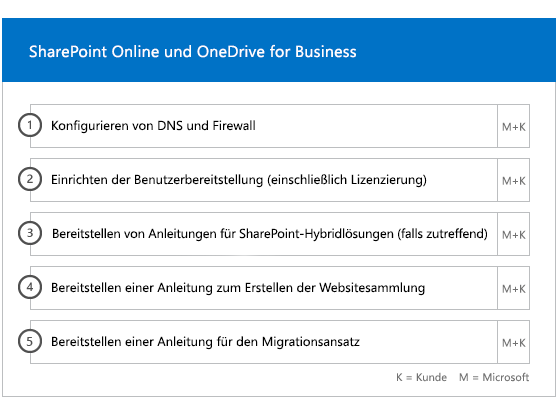
  
## OneDrive for Business

Für OneDrive for Business hängen die Schritte davon ab, ob Sie aktuell SharePoint nutzen, und falls ja, welche Version. 
  
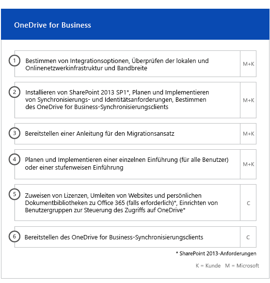
  
## Office 365 Advanced Threat Protection

Für Office 365 ATP stellen wir Anweisungen zu folgenden Themen bereit:
- Aktivieren von sicheren Links, sicheren Anlagen und Antiphishing. 
- Konfigurieren von Automatisierung, Untersuchung und Reaktion.
- Verwenden des Angriffssimulators.
- Berichterstellung und Bedrohungsanalyse.

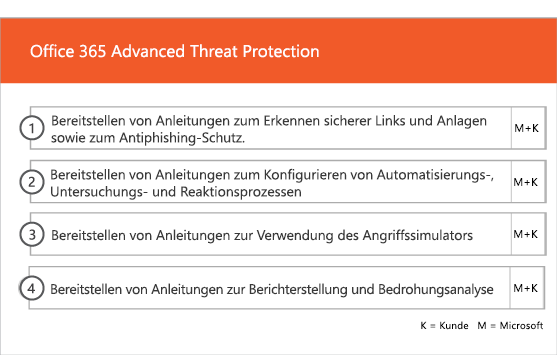

## Microsoft Teams

Für Microsoft Teams stellen wir Anweisungen zu folgenden Themen bereit:
- Sicherstellen der Mindestanforderungen  
- Konfigurieren von Firewallports.   
- Einrichten von DNS 
- Sicherstellen, dass Microsoft Teams auf Ihrem Office 365-Mandanten aktiviert ist  
- Aktivieren oder Deaktivieren von Benutzerlizenzen
    
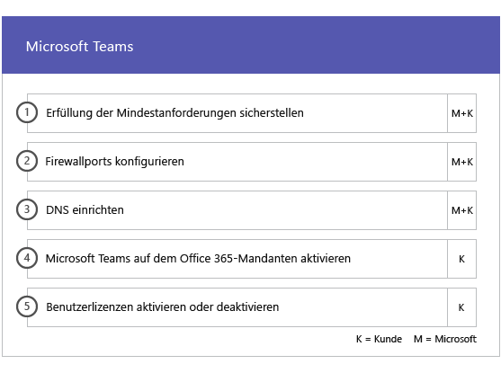

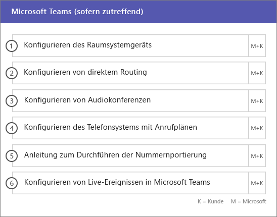

## Skype for Business Online

Für Skype for Business Online stellen wir Anweisungen zu folgenden Themen bereit:
- Konfigurieren von Firewallports.
- Einrichten von DNS   
- Erstellen von Konten für jedes Raumsystemgerät   
- Bereitstellen eines unterstützten Skype for Business Online-Clients  
- Einrichten einer Serverkonfiguration für geteilte Domänen zwischen Ihrer lokalen Lync 2010-, Lync 2013- oder Skype for Business 2015-Serverumgebung und einem Skype for Business Online-Mandanten (falls zutreffend), Anrufplänen, Skype-Livekonferenzen und einem Telefonsystem und Anrufplänen (auf verfügbaren Märkten).
    
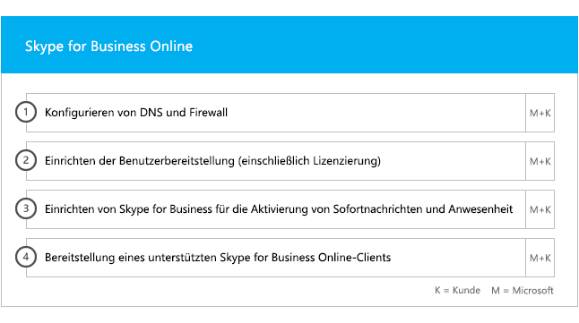
  
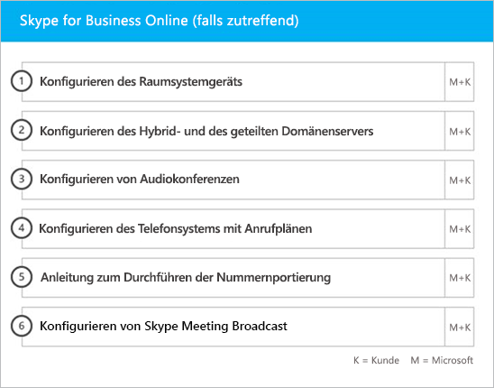
  
## Power BI

Für Power BI stellen wir Anweisungen zu folgenden Themen bereit: 
- Zuweisen von Power BI-Lizenzen.
- Bereitstellen der Power BI Desktop-App.
    
## Project Online

Für Project Online stellen wir Anweisungen zu folgenden Themen bereit:
  
- Überprüfen grundlegender SharePoint-Funktionen, auf denen Project Online basiert.   
- Hinzufügen des Project Online-Diensts zu Ihrem Mandanten (einschließlich des Hinzufügens von Abonnements zu Benutzern).  
- Einrichten des Enterprise-Ressourcenpools (ERP) 
- Erstellen Ihres ersten Projekts. 
    
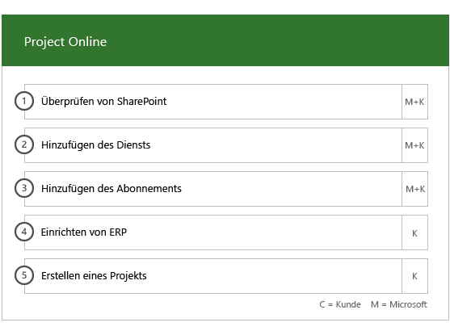
  
## Project Online Professional und Project Online Premium

Für Project Online Professional und Project Online Premium stellen wir Anweisungen zu folgenden Themen bereit:
- Beheben von Problemen bei der Bereitstellung
- Zuweisen von Endbenutzerlizenzen mit [Microsoft 365 Admin Center](https://go.microsoft.com/fwlink/?linkid=2032704) und Windows PowerShell  
- Installieren von Project Online-Desktopclient aus dem Office 365-Portal mithilfe von Klick-und-Los
- Konfigurieren von Updateeinstellungen mit dem Office 365-Bereitstellungstool  
- Einrichten eines einzelnen lokalen Verteilungsservers für Project Online-Desktopclient, einschließlich Unterstützung beim Erstellen einer configuration.xml-Datei für die Verwendung mit dem Office 365-Bereitstellungstool  
- Herstellen einer Verbindung zwischen Project Online-Desktopclient und Project Online Professional oder Project Online Premium.
    
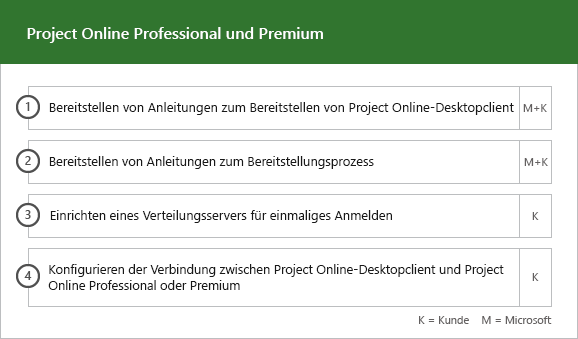
  
## Yammer Enterprise

Für Yammer stellen wir Anweisungen zum Aktivieren des Yammer Enterprise-Diensts bereit.
  
## Office 365 ProPlus

Für Office 365 ProPlus stellen wir Anweisungen zu folgenden Themen bereit:
- Beheben von Problemen bei der Bereitstellung   
- Zuweisen von Endbenutzerlizenzen mit [Microsoft 365 Admin Center](https://go.microsoft.com/fwlink/?linkid=2032704) und Windows PowerShell 
- Installieren von Office 365 ProPlus aus dem Office 365-Portal mithilfe von Klick-und-Los   
- Installieren von Office Mobile-Apps (wie Outlook Mobile, Word Mobile, Excel Mobile und PowerPoint Mobile) auf Ihren iOS-, Android- oder Windows Mobile-Geräten.   
- Konfigurieren von Updateeinstellungen mit dem Office 365-Bereitstellungstool   
- Auswahl und Einrichtung einer lokalen oder Cloud-Installation. 
- Erstellung der Konfigurations-XML des Office-Bereitstellungstool mit dem Office-Anpassungstool oder nativem XML zur Konfiguration des Bereitstellungspakets.  
- Bereitstellen mit Microsoft System Center Configuration Manager, einschließlich Unterstützung beim Erstellen des System Center Configuration Manager-Pakets
    
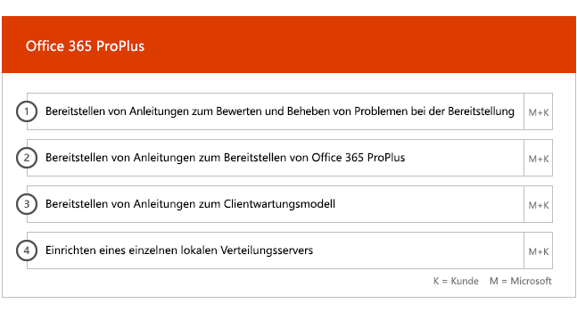
  
## Outlook für iOS und Android

Für Outlook für iOS und Android bieten wir Anleitung für:
- Herunterladen von Outlook für iOS und Android über den Apple App Store und Google Play
- Konfigurieren von Konten und Zugreifen auf das Exchange Online-Postfach

