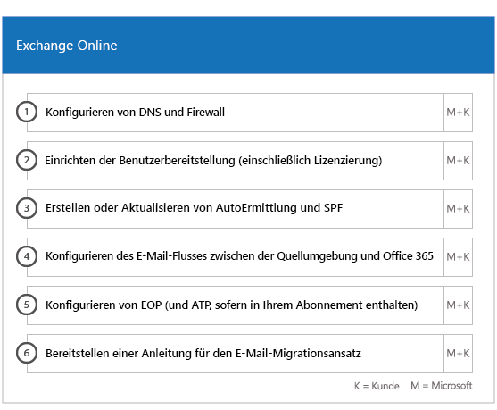
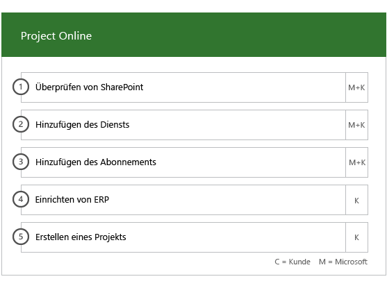

# Onboarding und Migration Phasen für Office 365 US-RegierungOnboarding and Migration Phases for Office 365 US Government

Das Onboarding von Office 365 besteht aus vier Phasen: Einleitung, Analyse, Korrektur und Aktivierung. Sie können diesen Phasen noch eine optionale Phase zur Datenmigration folgen lassen, wie in der folgenden Abbildung gezeigt.Office 365 onboarding has four primary phases—Initiate, Assess, Remediate, and Enable. You can follow these phases with an optional data migration phase as shown in the following figure.
  

  
Detaillierte Aufgaben für die einzelnen Phasen finden Sie unter [Schnelle Verantwortlichkeiten von Office 365 US-Regierung](US-Gov-appendix-fasttrack-responsibilities.md) und [Ihre Aufgaben für Office 365 US-Regierung](US-Gov-appendix-your-responsibilities.md).For detailed tasks for each phase, see [FastTrack Responsibilities for Office 365 US Government](US-Gov-appendix-fasttrack-responsibilities.md) and [Your Responsibilities for Office 365 US Government](US-Gov-appendix-your-responsibilities.md).
  
## EinleitungsphaseInitiate phase

Nachdem Sie die gewünschte Anzahl und die gewünschten Typen von Lizenzen erworben haben, müssen Sie die Anleitung in der E-Mail zur Kaufbestätigung befolgen, um die Lizenzen Ihrem vorhandenen oder neuen Mandanten zuzuordnen.After you purchase the appropriate number and types of licenses, follow the guidance from the purchase confirmation email to associate the licenses to your existing or new tenant. 
  
- Hilfestellung können Sie über das Office 365 Admin Center oder die [FastTrack-Website](https://go.microsoft.com/fwlink/?linkid=780698) anfordern. Für Support über das Office 365 Admin Center muss Ihr Administrator sich dort anmelden und anschließend auf das Widget **Need help?** klicken. Auch auf der [FastTrack-Website](https://go.microsoft.com/fwlink/?linkid=780698) müssen Sie sich zunächst anmelden. Klicken Sie dann auf **Services**, und füllen Sie das Formular **Request Assistance for Office 365** aus.You can get help through the Office 365 admin center or the [FastTrack site](https://go.microsoft.com/fwlink/?linkid=780698). To get help through the Office 365 admin center, your admin signs into the admin center and then clicks the **Need help?** widget. To get help through the [FastTrack site](https://go.microsoft.com/fwlink/?linkid=780698), sign in, click **Services**, and complete the **Request Assistance for Office 365** form. 
    > [!NOTE]
    >  Wenn in Ihrem Office 365-Mandanten ein Partner aufgelistet ist, wird diese Option nicht angezeigt. Bitten Sie Ihren Partner um Unterstützung.If you have a partner listed in your Office 365 tenant, you won't see this option. Please consult your partner for assistance. 
- Als Partner können Sie auch im Namen eines Kunden Hilfe auf der [FastTrack-Website](https://go.microsoft.com/fwlink/?linkid=780698) anfordern. Melden Sie sich dazu auf der Website an, wählen Sie den entsprechenden Kundendatensatz aus, und klicken Sie auf **Services**. Füllen Sie dann das Formular **Request Assistance for Office 365** aus.Partners can also get help through the [FastTrack site](https://go.microsoft.com/fwlink/?linkid=780698) on behalf of a customer. To do so, the partner signs in to the site, selects the customer record, clicks **Services**, and completes the **Request Assistance for Office 365** form.    
- Sie können auch über die [FastTrack-Website](https://go.microsoft.com/fwlink/?linkid=780698) in der Liste der verfügbaren Dienste für Ihren Mandanten Hilfe zu FastTrack Center anfordern. You can also ask for FastTrack Center help from the [FastTrack site](https://go.microsoft.com/fwlink/?linkid=780698) in the list of available services for your tenant. 
    
In dieser Phase werden der Onboarding-Prozess beschrieben, Ihre Daten überprüft und eine Einführungsbesprechung angesetzt.During this phase, we discuss the onboarding process, verify your data, and set up a kickoff meeting.
  
Dabei arbeiten wir Ihnen zusammen, um mehr über die beabsichtigte Nutzung des Diensts und die Ziele und Pläne Ihrer Organisation zur Steigerung der Nutzung des Diensts zu erfahren.This includes working with you to understand how you intend to use the service and your organization's goals and plans to drive service usage.
  

  
## AnalysephaseAssess phase

Ihr FastTrack Manager führt mit Ihnen und dem Einführungsteam ein interaktives Planungsgespräch. Dabei werden Ihnen die Funktionen der erworbenen Dienste, die wichtigsten Grundlagen für Ihren Erfolg, die Methodik zur Steigerung der Nutzung des Service und verschiedene Szenarios vorgestellt, wie Sie einen Nutzen aus den Diensten ziehen können. Wir unterstützen Sie bei der Erfolgsplanung und liefern, soweit erforderlich, Feedback zu wichtigen Bereichen.Your FastTrack Manager conducts an interactive success planning call with you and your adoption team. This introduces you to the capabilities of the eligible services you purchased, the key foundations you need for success, the methodology for driving usage of the service, and scenarios you can use to get value from the services. We assist you in success planning and provide feedback on key areas (as needed).
  
Schnelle Experten arbeiten mit Ihnen zur Bewertung der Source-Umgebung und die Anforderungen. Wir stellen Tools für die Sie sammeln Daten zu Ihrer Umgebung, und führen Sie durch die erforderliche Bandbreite geschätzt und Internet Browser, Clientbetriebssysteme, Domain Name System (DNS), Netzwerk, Infrastruktur und Identitätssystem zum Bewerten Ermitteln Sie, ob alle Änderungen für Onboarding erforderlich sind.FastTrack Specialists work with you to assess your source environment and the requirements. We provide tools for you to gather data about your environment and guide you through estimating bandwidth requirements and assessing your internet browsers, client operating systems, Domain Name System (DNS), network, infrastructure, and identity system to determine if any changes are required for onboarding. 
  
Basierend auf Ihrer aktuellen Einrichtung erstellen wir einen Korrekturplan. Nach Befolgen dieses Plans wird Ihre Quellumgebung an die Mindestanforderungen für ein erfolgreiches Onboarding für Office 365 und bei Bedarf eine erfolgreiche Postfach- und/oder Datenmigration angepasst. Wir stellen verschiedene mögliche Maßnahmen zur Verfügung, mit denen sich der Nutzen für Endbenutzer und die Akzeptanz durch diese steigern lassen. Für die Korrekturphase setzen wir auch entsprechende Telefonkonferenzen an.Based on your current setup, we provide a remediation plan that brings your source environment up to the minimum requirements for successful onboarding to Office 365 and, if needed, for successful mailbox and/or data migration. We provide a set of suggested activities to increase end user value and adoption. We also set up appropriate checkpoint calls for the Remediate phase.
  

  
## KorrekturphaseRemediate phase

Sie führen die Aufgaben im Korrekturplan für Ihre Quellumgebung aus, damit Sie die Anforderungen für das Onboarding, die Anpassung und die Migration der einzelnen Dienste erfüllen.You do the remediation tasks based on your source environment so that you meet the requirements for onboarding, adopting, and migrating each service as needed.
  

  
Wir stellen außerdem verschiedene mögliche Maßnahmen zur Verfügung, mit denen sich der Nutzen für Endbenutzer und die Akzeptanz durch diese steigern lassen. Vor Einleiten der Aktivierungsphase überprüfen wir gemeinsam die Ergebnisse der Korrekturaktivitäten, um sicherzustellen, dass Sie auf dem benötigten Stand sind.We also provide a set of suggested activities to increase end user value and adoption. Before beginning the Enable phase, we jointly verify the outcomes of the remediation activities to make sure you're ready to proceed. 
  
In dieser Phase arbeitet der FastTrack Manager mit Ihnen an der Erfolgsplanung und unterstützt Sie durch Anleitung bei der Wahl der richtigen Ressourcen und bewährten Methoden, mit denen Sie den Dienst in Ihrer Organisation zur Verfügung stellen und die Nutzung aller Dienste steigern können.During this phase, your FastTrack Manager works with you on success planning, guiding you to the right resources and best practices to provide guidance for you to make the service available to your organization and drive usage across the services.
  
## AktivierungsphaseEnable phase

Nach Abschluss aller Korrekturaktivitäten ist der nächste Schritt im Projekt die Konfiguration der Kerninfrastruktur für die Nutzung der Dienste, die Bereitstellung von Office 365 und das Ausführen von Aktivitäten zur Unterstützung der Diensteinführung.When all remediation activities are complete, the focus shifts to configuring the core infrastructure for service consumption, provisioning Office 365, and conducting the activities to drive service adoption. 
  
## Haupt-OnboardingCore

Zum Haupt-Onboarding zählen die Bereitstellung des Diensts sowie die Integration von Mandanten und Identitäten. Ferner gehören dazu grundlegende Schritte für das Onboarding von Diensten wie Exchange Online, SharePoint Online und Skype for Business Online. Es finden weiterhin Besprechungen zur Erfolgsplanung mit Ihrem FastTrack Manager statt, in denen Sie Ihren Fortschritt bewerten und bestimmen, wie wir Sie in der Zukunft unterstützen können.Core onboarding involves service provisioning and tenant and identity integration. It also includes steps for providing a foundation for onboarding services like Exchange Online, SharePoint Online, and Skype for Business Online. You and your FastTrack Manager continue to have success planning checkpoint meetings to evaluate progress against your goals and determine what further assistance you need.
  

  

  
> [!NOTE]
> WAP steht für Webanwendungsproxy SSL steht für Secure Sockets Layer SDS steht für School Data Sync Weitere Informationen zu SDS finden Sie unter [Willkommen bei Microsoft School Data Sync](https://go.microsoft.com/fwlink/?linkid=871480).WAP stands for Web Application Proxy. SSL stands for Secure Sockets Layer. SDS stands for School Data Sync. For more information on SDS, see [Welcome to Microsoft School Data Sync](https://go.microsoft.com/fwlink/?linkid=871480). 
  
Das Onboarding für einen oder mehrere berechtigte Dienste kann beginnen, sobald das Haupt-Onboarding abgeschlossen ist.Onboarding for one or more eligible services can begin once core onboarding is finished.
  
## Exchange OnlineExchange Online

Bei Exchange Online leiten wir Sie durch den Vorgang, die Verwendung von E-Mail für Ihre Organisation einzurichten. Welche Schritte genau dazu notwendig sind, hängt von Ihrer Quellumgebung und Ihren E-Mail-Migrationsplänen ab. Dies können unter anderem die folgenden Schritte sein:For Exchange Online, we guide you through the process to get your organization ready to use email. The exact steps, depending on your source environment and your email migration plans, can include providing guidance for:
  
- Einrichten von Exchange Online Protection (EOP)-Funktionen für alle E-Mail-aktivierten Domänen, die in Office 365 überprüft wurden.Setting up Exchange Online Protection (EOP) features for all mail-enabled domains validated in Office 365.   
    > [!NOTE]
    > Ihre MX-Einträge (Mail Exchange) müssen auf Office 365 verweisen.Your mail exchange (MX) records must point to Office 365.   
- Einrichten der Exchange Online Advanced Threat Protection (ATP)-Funktion, wenn diese Bestandteil Ihres Abonnementdiensts ist, sobald Ihre MX-Einträge auf Office 365 verweisen. Diese Funktion wird im Rahmen der Antischadsoftware-Einstellungen von Exchange Online Protection konfiguriert.Setting up the Exchange Online Advanced Threat Protection (ATP) feature if it's part of your subscription service once your MX records point to Office 365. This feature is configured as part of the Exchange Online Protection antimalware settings.   
- Konfigurieren von Firewallports.Configuring firewall ports.   
- Einrichten von DNS, einschließlich der erforderlichen AutoErmittlungs-, SPF (Sender Policy Framework)- und MX-Einträge (falls erforderlich).Setting up DNS, including the required Autodiscover, sender policy framework (SPF), and MX records (as needed).     
- Einrichten des E-Mail-Nachrichtenflusses zwischen Ihrer Quellmessagingumgebung und Exchange Online (bei Bedarf)Setting up email flow between your source messaging environment and Exchange Online (as needed).   
- Durchführen der E-Mail-Migration von Ihrer Quellmessagingumgebung zu Office 365.Undertaking mail migration from your source messaging environment to Office 365.   
    > [!NOTE]
    > Weitere Informationen zur E-Mail- und Datenmigration finden Sie unter [Datenmigration](data-migration.md).For more information on mail and data migration, see [Data Migration](data-migration.md). 
  

  
## SharePoint Online und OneDrive for BusinessSharePoint Online and OneDrive for Business

Für SharePoint Online und OneDrive for Business stellen wir Anweisungen zu folgenden Themen bereit:For SharePoint Online and OneDrive for Business, we provide guidance for: 
- Einrichten von DNSSetting up DNS.   
- Konfigurieren von Firewallports.Configuring firewall ports.   
- Bereitstellen von Benutzern und Lizenzen.Provisioning users and licenses.   
- Konfigurieren von SharePoint-Hybridlösung-Features, z. B. Hybridsuche, Hybridwebsites, Hybridtaxonomie, Inhaltstypen, Self-Service Site Creation für hybride Sites (nur SharePoint Server 2013), erweitertes App-Startfeld, Hybrid-OneDrive for Business und Extranet-Websites.Configuring SharePoint Hybrid features, like hybrid search, hybrid sites, hybrid taxonomy, content types, hybrid self-service site creation (SharePoint Server 2013 only), extended app launcher, hybrid OneDrive for Business, and extranet sites.
    
FastTrack-Experten bieten Anleitung für die Datenmigration zu Office 365. Sie helfen Ihnen mit einer Kombination aus Tools und Dokumentation und führen gegebenenfalls Konfigurationsaufgaben aus.FastTrack Specialists provide guidance on data migration to Office 365 by using a combination of tools and documentation and by performing configuration tasks where applicable and feasible.
  

  
## OneDrive for BusinessOneDrive for Business

Für OneDrive for Business hängen die Schritte davon ab, ob Sie aktuell SharePoint nutzen, und falls ja, welche Version.For OneDrive for Business, the steps depend on if you're currently using SharePoint, and if so, which version. 
  

  
## Skype for Business OnlineSkype for Business Online

Für Skype for Business Online stellen wir Anweisungen zu folgenden Themen bereit:For Skype for Business Online, we provide guidance for: 
- Konfigurieren von Firewallports.Configuring firewall ports.    
- Einrichten von DNSSetting up DNS.    
- Erstellen von Konten für jedes RaumsystemgerätCreating accounts for any room system devices.    
- Bereitstellen eines unterstützten Skype for Business Online-ClientsDeploying a supported Skype for Business Online client.   
- Einrichten von geteilte Domäne Serverkonfiguration zwischen Ihrer lokalen Lync 2010 Mandanten für Lync 2013, oder Skype für 2015 Business Server-Umgebung und Skype für Business Online (falls zutreffend).Establishing split domain server configuration between your on-premises Lync 2010, Lync 2013, or Skype for Business 2015 server environment and Skype for Business Online tenant (if applicable).
- Aktivieren der Pläne aufrufen, Skype Besprechung übertragen, und Telefonsystem und Pläne (in verfügbaren Märkte – hohe GCC oder DoD Pläne nicht verfügbar) aufrufen.Enabling Calling Plans, Skype Meeting Broadcast, and Phone System and Calling Plans (in available markets – not available in GCC High or DoD plans). 
    

  

  
## Microsoft TeamsMicrosoft Teams

> [!NOTE]
> Die folgenden nicht GCC hohe oder DoD Pläne zur Verfügung.The following isn’t available in GCC High or DoD plans.

Für Microsoft Teams stellen wir Anweisungen zu folgenden Themen bereit:For Microsoft Teams, we provide guidance for: 
- Sicherstellen der MindestanforderungenConfirming minimum requirements.   
- Konfigurieren von Firewallports.Configuring firewall ports.   
- Einrichten von DNSSetting up DNS.  
- Sicherstellen, dass Microsoft Teams auf Ihrem Office 365-Mandanten aktiviert istConfirming Microsoft Teams is enabled on your Office 365 tenant.    
- Aktivieren oder Deaktivieren von BenutzerlizenzenEnabling or disabling user licenses.
    

  
## Power BIPower BI

Für Power BI stellen wir Anweisungen zu folgenden Themen bereit:For Power BI, we provide guidance for:  
- Zuweisen von Power BI-Lizenzen.Assigning Power BI licenses.    
- Bereitstellen der Power BI Desktop-App.Deploying the Power BI Desktop app.   
## Project OnlineProject Online

Für Project Online stellen wir Anweisungen zu folgenden Themen bereit:For Project Online, we provide guidance for: 
- Überprüfen grundlegender SharePoint-Funktionen, auf denen Project Online basiert.Verifying basic SharePoint functionality that Project Online relies on.    
- Hinzufügen des Project Online-Diensts zu Ihrem Mandanten (einschließlich des Hinzufügens von Abonnements zu Benutzern).Adding the Project Online service to your tenant (including adding subscriptions to users).    
- Einrichten des Enterprise-Ressourcenpools (ERP)Setting up the Enterprise Resource Pool (ERP).   
- Erstellen Ihres ersten Projekts.Creating your first project. 
    

  
## Yammer EnterpriseYammer Enterprise

Für Yammer stellen wir Anweisungen zum Aktivieren des Yammer Enterprise-Diensts bereit.For Yammer, we provide guidance for enabling the Yammer Enterprise service.

> [!NOTE]
> Yammer Enterprise ist eine Komponente des Office-365 US-Regierung nicht aber kostenlos erworben werden kann, wie ein eigenständiges Angebot für jeden Benutzer für Office 365 in GCC lizenziert. Dieses Angebot ist derzeit für Kunden, die Office 365 GCC unter Enterprise Agreement und Enterprise-Abonnement Agreement erwerben beschränkt. Yammer ist nicht hoch GCC oder DoD Pläne verfügbar.Yammer Enterprise isn’t a component of Office 365 US Government but can be acquired at no cost as a standalone offer for each user licensed for Office 365 in GCC. This offer is currently limited to customers that purchase Office 365 GCC under Enterprise Agreements and Enterprise Subscription Agreements. Yammer isn’t available in GCC High or DoD plans. 
  
## Office 365 ProPlusOffice 365 ProPlus

Für Office 365 ProPlus stellen wir Anweisungen zu folgenden Themen bereit:For Office 365 ProPlus, we provide guidance for: 
- Beheben von Problemen bei der BereitstellungAddressing deployment issues.    
- Zuweisen von Endbenutzerlizenzen mitOffice 365 Admin Center und Windows PowerShellAssigning end-user licenses using the Office 365 admin center and Windows PowerShell.    
- Installieren von Office 365 ProPlus aus dem Office 365-Portal mithilfe von Klick-und-LosInstalling Office 365 ProPlus from the Office 365 portal using Click-to-Run.    
- Installieren von Office Mobile-Apps (wie Outlook Mobile, Word Mobile, Excel Mobile und PowerPoint Mobile) auf Ihren iOS-, Android- oder Windows Mobile-Geräten.Installing Office Mobile apps (like Outlook Mobile, Word Mobile, Excel Mobile, and PowerPoint Mobile) on your iOS, Android, or Windows Mobile devices.   
- Konfigurieren von Updateeinstellungen mit dem Office-BereitstellungstoolConfiguring update settings using the Office Deployment Tool.    
- Einrichten eines einzelnen lokalen Verteilungsservers für Office 365 ProPlus, einschließlich Unterstützung beim Erstellen einer configuration.xml-Datei für die Verwendung mit dem Office-BereitstellungstoolSetting up a single on-site distribution server for Office 365 ProPlus, including assistance with the creation of a configuration.xml file for use with the Office Deployment Tool.    
- Bereitstellen mit Microsoft System Center Configuration Manager, einschließlich Unterstützung beim Erstellen des System Center Configuration Manager-PaketsDeployment using Microsoft System Center Configuration Manager, including assistance with the creation of System Center Configuration Manager packaging.
    

  

  

