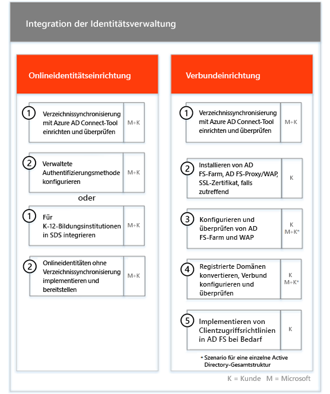
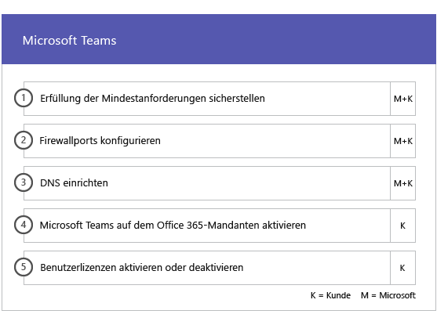
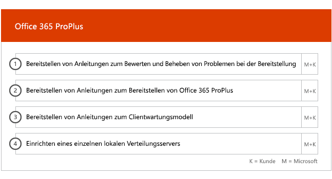

# Onboarding und Migration Phasen für Office 365 US-Regierung

Das Onboarding von Office 365 besteht aus vier Phasen: Einleitung, Analyse, Korrektur und Aktivierung. Sie können diesen Phasen noch eine optionale Phase zur Datenmigration folgen lassen, wie in der folgenden Abbildung gezeigt.
  

  
Detaillierte Aufgaben für die einzelnen Phasen finden Sie unter [Schnelle Verantwortlichkeiten von Office 365 US-Regierung](US-Gov-appendix-fasttrack-responsibilities.md) und [Ihre Aufgaben für Office 365 US-Regierung](US-Gov-appendix-your-responsibilities.md).
  
## Einleitungsphase

Nachdem Sie die gewünschte Anzahl und die gewünschten Typen von Lizenzen erworben haben, müssen Sie die Anleitung in der E-Mail zur Kaufbestätigung befolgen, um die Lizenzen Ihrem vorhandenen oder neuen Mandanten zuzuordnen. 
  
- Hilfestellung können Sie über das Office 365 Admin Center oder die [FastTrack-Website](https://go.microsoft.com/fwlink/?linkid=780698) anfordern. Für Support über das Office 365 Admin Center muss Ihr Administrator sich dort anmelden und anschließend auf das Widget **Need help?** klicken. Auch auf der [FastTrack-Website](https://go.microsoft.com/fwlink/?linkid=780698) müssen Sie sich zunächst anmelden. Klicken Sie dann auf **Services**, und füllen Sie das Formular **Request Assistance for Office 365** aus. 
    
    > [!NOTE]
    >  Wenn in Ihrem Office 365-Mandanten ein Partner aufgelistet ist, wird diese Option nicht angezeigt. Bitten Sie Ihren Partner um Unterstützung. 
  
- Als Partner können Sie auch im Namen eines Kunden Hilfe auf der [FastTrack-Website](https://go.microsoft.com/fwlink/?linkid=780698) anfordern. Melden Sie sich dazu auf der Website an, wählen Sie den entsprechenden Kundendatensatz aus, und klicken Sie auf **Services**. Füllen Sie dann das Formular **Request Assistance for Office 365** aus. 
    
- Sie können auch über die [FastTrack-Website](https://go.microsoft.com/fwlink/?linkid=780698) in der Liste der verfügbaren Dienste für Ihren Mandanten Hilfe zu FastTrack Center anfordern.  
    
In dieser Phase werden der Onboarding-Prozess beschrieben, Ihre Daten überprüft und eine Einführungsbesprechung angesetzt.
  
Dabei arbeiten wir Ihnen zusammen, um mehr über die beabsichtigte Nutzung des Diensts und die Ziele und Pläne Ihrer Organisation zur Steigerung der Nutzung des Diensts zu erfahren.
  

  
## Analysephase

Ihr FastTrack Manager führt mit Ihnen und dem Einführungsteam ein interaktives Planungsgespräch. Dabei werden Ihnen die Funktionen der erworbenen Dienste, die wichtigsten Grundlagen für Ihren Erfolg, die Methodik zur Steigerung der Nutzung des Service und verschiedene Szenarios vorgestellt, wie Sie einen Nutzen aus den Diensten ziehen können. Wir unterstützen Sie bei der Erfolgsplanung und liefern, soweit erforderlich, Feedback zu wichtigen Bereichen.
  
Schnelle Experten arbeiten mit Ihnen zur Bewertung der Source-Umgebung und die Anforderungen. Wir stellen Tools für die Sie sammeln Daten zu Ihrer Umgebung, und führen Sie durch die erforderliche Bandbreite geschätzt und Internet Browser, Clientbetriebssysteme, Domain Name System (DNS), Netzwerk, Infrastruktur und Identitätssystem zum Bewerten Ermitteln Sie, ob alle Änderungen für Onboarding erforderlich sind. 
  
Basierend auf Ihrer aktuellen Einrichtung erstellen wir einen Korrekturplan. Nach Befolgen dieses Plans wird Ihre Quellumgebung an die Mindestanforderungen für ein erfolgreiches Onboarding für Office 365 und bei Bedarf eine erfolgreiche Postfach- und/oder Datenmigration angepasst. Wir stellen verschiedene mögliche Maßnahmen zur Verfügung, mit denen sich der Nutzen für Endbenutzer und die Akzeptanz durch diese steigern lassen. Für die Korrekturphase setzen wir auch entsprechende Telefonkonferenzen an.
  

  
## Korrekturphase

Sie führen die Aufgaben im Korrekturplan für Ihre Quellumgebung aus, damit Sie die Anforderungen für das Onboarding, die Anpassung und die Migration der einzelnen Dienste erfüllen.
  

  
Wir stellen außerdem verschiedene mögliche Maßnahmen zur Verfügung, mit denen sich der Nutzen für Endbenutzer und die Akzeptanz durch diese steigern lassen. Vor Einleiten der Aktivierungsphase überprüfen wir gemeinsam die Ergebnisse der Korrekturaktivitäten, um sicherzustellen, dass Sie auf dem benötigten Stand sind. 
  
In dieser Phase arbeitet der FastTrack Manager mit Ihnen an der Erfolgsplanung und unterstützt Sie durch Anleitung bei der Wahl der richtigen Ressourcen und bewährten Methoden, mit denen Sie den Dienst in Ihrer Organisation zur Verfügung stellen und die Nutzung aller Dienste steigern können.
  
## Aktivierungsphase

Nach Abschluss aller Korrekturaktivitäten ist der nächste Schritt im Projekt die Konfiguration der Kerninfrastruktur für die Nutzung der Dienste, die Bereitstellung von Office 365 und das Ausführen von Aktivitäten zur Unterstützung der Diensteinführung. 
  
## Haupt-Onboarding

Zum Haupt-Onboarding zählen die Bereitstellung des Diensts sowie die Integration von Mandanten und Identitäten. Ferner gehören dazu grundlegende Schritte für das Onboarding von Diensten wie Exchange Online, SharePoint Online und Skype for Business Online. Es finden weiterhin Besprechungen zur Erfolgsplanung mit Ihrem FastTrack Manager statt, in denen Sie Ihren Fortschritt bewerten und bestimmen, wie wir Sie in der Zukunft unterstützen können.
  

  

  
> [!NOTE]
> WAP steht für Webanwendungsproxy SSL steht für Secure Sockets Layer SDS steht für School Data Sync Weitere Informationen zu SDS finden Sie unter [Willkommen bei Microsoft School Data Sync](https://go.microsoft.com/fwlink/?linkid=871480). 
  
Das Onboarding für einen oder mehrere berechtigte Dienste kann beginnen, sobald das Haupt-Onboarding abgeschlossen ist.
  
## Exchange Online

Bei Exchange Online leiten wir Sie durch den Vorgang, die Verwendung von E-Mail für Ihre Organisation einzurichten. Welche Schritte genau dazu notwendig sind, hängt von Ihrer Quellumgebung und Ihren E-Mail-Migrationsplänen ab. Dies können unter anderem die folgenden Schritte sein:
  
- Einrichten von Exchange Online Protection (EOP)-Funktionen für alle E-Mail-aktivierten Domänen, die in Office 365 überprüft wurden.
    
    > [!NOTE]
    > Ihre MX-Einträge (Mail Exchange) müssen auf Office 365 verweisen. 
  
- Einrichten der Exchange Online Advanced Threat Protection (ATP)-Funktion, wenn diese Bestandteil Ihres Abonnementdiensts ist, sobald Ihre MX-Einträge auf Office 365 verweisen. Diese Funktion wird im Rahmen der Antischadsoftware-Einstellungen von Exchange Online Protection konfiguriert.
    
- Konfigurieren von Firewallports.
    
- Einrichten von DNS, einschließlich der erforderlichen AutoErmittlungs-, SPF (Sender Policy Framework)- und MX-Einträge (falls erforderlich). 
    
- Einrichten des E-Mail-Nachrichtenflusses zwischen Ihrer Quellmessagingumgebung und Exchange Online (bei Bedarf)
    
- Durchführen der E-Mail-Migration von Ihrer Quellmessagingumgebung zu Office 365.
    
    > [!NOTE]
    > Weitere Informationen zur E-Mail- und Datenmigration finden Sie unter [Datenmigration](data-migration.md). 
  

  
## SharePoint Online und OneDrive for Business

Für SharePoint Online und OneDrive for Business stellen wir Anweisungen zu folgenden Themen bereit:
  
- Einrichten von DNS
    
- Konfigurieren von Firewallports.
    
- Bereitstellen von Benutzern und Lizenzen.
    
- Konfigurieren von SharePoint-Hybridlösung-Features, z. B. Hybridsuche, Hybridwebsites, Hybridtaxonomie, Inhaltstypen, Self-Service Site Creation für hybride Sites (nur SharePoint Server 2013), erweitertes App-Startfeld, Hybrid-OneDrive for Business und Extranet-Websites.
    
FastTrack-Experten bieten Anleitung für die Datenmigration zu Office 365. Sie helfen Ihnen mit einer Kombination aus Tools und Dokumentation und führen gegebenenfalls Konfigurationsaufgaben aus.
  

  
## OneDrive for Business

Für OneDrive for Business hängen die Schritte davon ab, ob Sie aktuell SharePoint nutzen, und falls ja, welche Version. 
  

  
## Skype for Business Online

Für Skype for Business Online stellen wir Anweisungen zu folgenden Themen bereit:
  
- Konfigurieren von Firewallports.
    
- Einrichten von DNS
    
- Erstellen von Konten für jedes Raumsystemgerät
    
- Bereitstellen eines unterstützten Skype for Business Online-Clients
    
- Einrichten von geteilte Domäne Serverkonfiguration zwischen Ihrer lokalen Lync 2010 Mandanten für Lync 2013, oder Skype für 2015 Business Server-Umgebung und Skype für Business Online (falls zutreffend).

- Aktivieren der Pläne aufrufen, Skype Besprechung übertragen, und Telefonsystem und Pläne (in verfügbaren Märkte – hohe GCC oder DoD Pläne nicht verfügbar) aufrufen. 
    

  

  
## Microsoft Teams

> [!NOTE]
> Die folgenden nicht GCC hohe oder DoD Pläne zur Verfügung.

Für Microsoft Teams stellen wir Anweisungen zu folgenden Themen bereit:
  
- Sicherstellen der Mindestanforderungen
    
- Konfigurieren von Firewallports.
    
- Einrichten von DNS
    
- Sicherstellen, dass Microsoft Teams auf Ihrem Office 365-Mandanten aktiviert ist
    
- Aktivieren oder Deaktivieren von Benutzerlizenzen
    

  
## Power BI

Für Power BI stellen wir Anweisungen zu folgenden Themen bereit: 
  
- Zuweisen von Power BI-Lizenzen.
    
- Bereitstellen der Power BI Desktop-App.
    
## Project Online

Für Project Online stellen wir Anweisungen zu folgenden Themen bereit:
  
- Überprüfen grundlegender SharePoint-Funktionen, auf denen Project Online basiert.
    
- Hinzufügen des Project Online-Diensts zu Ihrem Mandanten (einschließlich des Hinzufügens von Abonnements zu Benutzern).
    
- Einrichten des Enterprise-Ressourcenpools (ERP)
    
- Erstellen Ihres ersten Projekts. 
    

  
## Yammer Enterprise

Für Yammer stellen wir Anweisungen zum Aktivieren des Yammer Enterprise-Diensts bereit.

> [!NOTE]
> Yammer Enterprise ist eine Komponente des Office-365 US-Regierung nicht aber kostenlos erworben werden kann, wie ein eigenständiges Angebot für jeden Benutzer für Office 365 in GCC lizenziert. Dieses Angebot ist derzeit für Kunden, die Office 365 GCC unter Enterprise Agreement und Enterprise-Abonnement Agreement erwerben beschränkt. Yammer ist nicht hoch GCC oder DoD Pläne verfügbar. 
  
## Office 365 ProPlus

Für Office 365 ProPlus stellen wir Anweisungen zu folgenden Themen bereit:
  
- Beheben von Problemen bei der Bereitstellung
    
- Zuweisen von Endbenutzerlizenzen mitOffice 365 Admin Center und Windows PowerShell
    
- Installieren von Office 365 ProPlus aus dem Office 365-Portal mithilfe von Klick-und-Los
    
- Installieren von Office Mobile-Apps (wie Outlook Mobile, Word Mobile, Excel Mobile und PowerPoint Mobile) auf Ihren iOS-, Android- oder Windows Mobile-Geräten. 
    
- Konfigurieren von Updateeinstellungen mit dem Office-Bereitstellungstool
    
- Einrichten eines einzelnen lokalen Verteilungsservers für Office 365 ProPlus, einschließlich Unterstützung beim Erstellen einer configuration.xml-Datei für die Verwendung mit dem Office-Bereitstellungstool
    
- Bereitstellen mit Microsoft System Center Configuration Manager, einschließlich Unterstützung beim Erstellen des System Center Configuration Manager-Pakets
    

  

  

