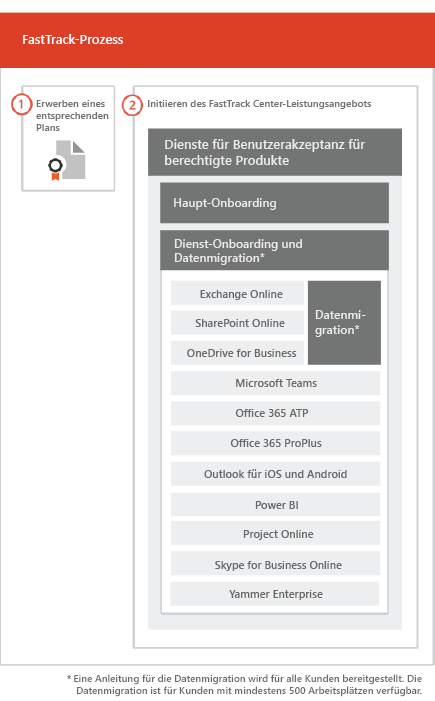

# Der FastTrack-ProzessThe FastTrack Process

Der FastTrack-Prozess stellt Dienste für Onboarding und Benutzerakzeptanz bereit. The FastTrack process provides onboarding and user adoption services. 
  
Das Onboarding besteht aus:Onboarding consists of:
  
- *Haupt-Onboarding* – Umfasst die Aufgaben, die bei Bedarf für die Mandantenkonfiguration und die Integration mit Azure Active Directory (Azure AD) ausgeführt werden müssen. Das Haupt-Onboarding stellt auch die Grundlage für das Onboarding anderer berechtigter Dienste dar.Core onboarding — These are tasks required for tenant configuration and integration with Azure Active Directory (Azure AD) if needed. Core onboarding also provides the baseline for onboarding other eligible services. 
    
- *Dienst-Onboarding und -Migration* – Dienst-Onboardingaktivitäten ermöglichen Szenarios in Ihrem Mandanten. Die Migration von Daten (einschließlich E-Mails und Dateien) wird unter [Datenmigration](data-migration.md) behandelt. *Service onboarding and migration* — Service onboarding tasks enable scenarios in your tenant. Data migration (including email and files) is covered in [Data Migration](data-migration.md). 
    
Die Dienste für die Benutzerakzeptanz bestehen aus Aufgaben, die Ihnen eine Anleitung bereitstellen, wie Sie sicherstellen, dass die Benutzer die jeweiligen Dienste kennen und sie zum Erzielen geschäftlicher Vorteile nutzen können. Diese Unterstützung erfolgt parallel zu den Onboarding-Aktivitäten.User adoption services are comprised of tasks that provide guidance for you to ensure your users are aware of the eligible services and can use them to drive business value. This assistance occurs in parallel to onboarding activities.
  
> [!NOTE]
> FastTrack bietet Kunden einen empfohlenen Ansatz, Anleitungen und bewährte Methoden für schnelle und vorhersehbare Ergebnisse. Wenn Sie nicht entsprechend dieser Anleitungen bereitstellen, werden die Onboarding-Erfahrung und die Verwendung dieses Diensts möglicherweise beeinträchtigt. Eine Anleitung wird als eine Kombination aus mündlicher und schriftlicher Unterstützung definiert. Wenn FastTrack-Experten eine Anleitung bereitstellen, können FastTrack-Mitarbeiter nicht in Ihrem Auftrag handeln. Sie können FastTrack-Dienste für Onboarding und Benutzerakzeptanz für alle qualifizierenden Produktarbeitsauslastungen verwenden, solange Ihr Abonnement gültig ist. FastTrack provides customers with a recommended approach, guidance, and best practices engineered to deliver quick and predictable outcomes. If you choose to deploy outside of this guidance, your onboarding experience and usage of the service may be impacted. Guidance is defined as a combination of verbal and written assistance. When FastTrack Specialists provide guidance, FastTrack personnel cannot act on your behalf. You can use FastTrack services to onboard and adopt any qualifying product workload as long as your subscription is current. 
  
## Der Onboarding-ProzessThe onboarding process

In der folgenden Abbildung wird der Onboarding-Prozess dargestellt.The following diagram illustrates the onboarding process.
  

  
- Hilfestellung können Sie über das Office 365 Admin Center oder die [FastTrack-Website](https://go.microsoft.com/fwlink/?linkid=780698) anfordern. Für Support über das Office 365 Admin Center muss Ihr Administrator sich dort anmelden und anschließend auf das Widget **Need help?** klicken. Auch auf der [FastTrack-Website](https://go.microsoft.com/fwlink/?linkid=780698) müssen Sie sich zunächst anmelden. Klicken Sie dann auf **Services**, und füllen Sie das Formular **Request Assistance for Office 365** aus.You can get help through the Office 365 admin center or the [FastTrack site](https://go.microsoft.com/fwlink/?linkid=780698). To get help through the Office 365 admin center, your admin signs into the admin center and then clicks the **Need help?** widget. To get help through the [FastTrack site](https://go.microsoft.com/fwlink/?linkid=780698), sign in, click **Services**, and complete the **Request Assistance for Office 365** form. 
    
    > [!NOTE]
    >  Wenn in Ihrem Office 365-Mandanten ein Partner aufgelistet ist, wird diese Option nicht angezeigt. Bitten Sie Ihren Partner um Unterstützung.If you have a partner listed in your Office 365 tenant, you won't see this option. Please consult your partner for assistance. 
  
    Sie können auch über die [FastTrack-Website](https://go.microsoft.com/fwlink/?linkid=780698) in der Liste der verfügbaren Dienste für Ihren Mandanten Hilfe zu FastTrack Center anfordern. You can also ask for FastTrack Center help from the [FastTrack site](https://go.microsoft.com/fwlink/?linkid=780698) in the list of available services for your tenant. 
    
    Sobald die Onboarding-Unterstützung begonnen hat, richten wir einen Zeitplan für Onlinebesprechungen ein.Once onboarding assistance starts, we set up a schedule of online meetings.
    
- Als Partner können Sie auch im Namen eines Kunden Hilfe auf der [FastTrack-Website](https://go.microsoft.com/fwlink/?linkid=780698) anfordern. Melden Sie sich dazu auf der Website an, wählen Sie den entsprechenden Kundendatensatz aus, und klicken Sie auf **Services**. Füllen Sie dann das Formular **Request Assistance for Office 365** aus.Partners can also get help through the [FastTrack site](https://go.microsoft.com/fwlink/?linkid=780698) on behalf of a customer. To do so, the partner signs in to the site, selects the customer record, clicks **Services**, and completes the **Request Assistance for Office 365** form. 
    
- Das FastTrack-Team bietet Anleitung für das Onboarding und die Planung der erfolgreichen Einführung der Dienste.The FastTrack team provides guidance with core and service onboarding and planning successful adoption of eligible services.
    
- FastTrack-Experten stellen alle Dienste für Onboarding, Migration und die Benutzerakzeptanz remote bereit.FastTrack Specialists provide all onboarding, migration, and user adoption services remotely.
    
- FastTrack-Experten unterstützen Sie remote mithilfe einer Kombination aus Tools und veröffentlichter Dokumentation.FastTrack Specialists assist you remotely by using a combination of tools and published documentation.
    
- Das FastTrack Center bietet Unterstützung und steht in der jeweiligen Region zu den üblichen Geschäftszeiten zur Verfügung.The FastTrack Center provides assistance and is available during normal business hours for a given region.
    
- Die Unterstützung ist in den folgenden Sprachen verfügbar: Deutsch, Englisch, Französisch, Italienisch, Japanisch, Koreanisch, Portugiesisch (Brasilien), Spanisch, Thai, Vietnamesisch, traditionelles Chinesisch und Chinesisch (vereinfacht) (Ressourcen sprechen nur Mandarin).Assistance is available in Traditional Chinese and Simplified Chinese (resources speak Mandarin only), English, French, German, Italian, Japanese, Korean, Portuguese (Brazil), Spanish, Thai, and Vietnamese.
    
-  FastTrack-Experten können direkt mit Ihnen oder Ihrem Bevollmächtigten zusammenarbeiten.FastTrack Specialists can work directly with you or your representative. 
    
- FastTrack-Experten stellen Anleitung für E-Mail- und Datenmigration bereit.FastTrack Specialists provide email and data migration guidance.
    

  

